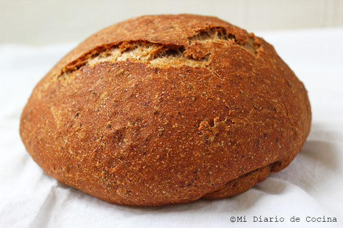

# Pan integral

## Ingredientes

* Agua (370 ml)
* Aceite (chorrito)
* Sal (una pizca)
* Azúcar (una pizca) o miel
* 270 g de harina de fuerza
* 270 g de harina integral
* 2 cucharadas de avena (salvado)
* 1 sobre de levadura seca de panadero
* Arándanos, pasas, pipas, chía, lino (al gusto, opcional)

## Preparación

1. En un bol grande, mezcla el agua tibia, el aceite, la sal, el azúcar (o miel), la harina de fuerza, la harina integral, la avena y la levadura seca de panadero.
   
2. Amasa todos los ingredientes hasta obtener una masa homogénea y elástica.

3. Cubre el bol con un paño limpio y deja fermentar la masa en un lugar cálido hasta que doble su volumen, aproximadamente 1 hora.

4. Vuelve a amasar ligeramente la masa y añade los arándanos, pasas, pipas, chía, lino u otros ingredientes que desees incorporar.

5. Moldea la masa según tu preferencia (puedes hacer panes pequeños individuales o uno grande).

6. Coloca el pan en una bandeja de horno forrada con papel vegetal o engrasada, cubre nuevamente con un paño y deja fermentar durante 30-45 minutos más.

7. Precalienta el horno a 175°C.

8. Hornea el pan durante 30-40 minutos o hasta que esté dorado y suene hueco al golpearlo por debajo.

9. Deja enfriar el pan sobre una rejilla antes de cortarlo y disfrutarlo.

## Trucos para amasar

- Untar las manos con un poco de aceite facilita el manejo de la masa.
- Puedes utilizar productos como Mepantol (evital) o aceite de árbol de té para mejorar la textura y el aroma de tu pan.

