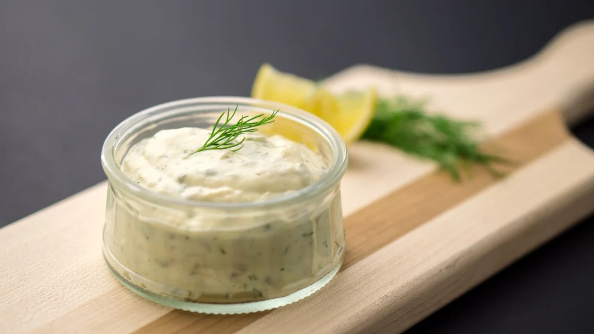

# Salsa tártara

## Ingredientes

- 200 g de mayonesa
- 1 huevo cocido
- 25 g de alcaparras
- 25 g de pepinillos en vinagre
- 50 g de cebolla
- 1 cucharadita de mostaza
- Perejil picado

## Preparación

1. Primero hacemos la mayonesa tal y como hemos indicado en cómo hacer mayonesa.
2. Aparte, picamos muy finamente las alcaparras (ligeramente escurridas), los pepinillos en vinagre, la cebolla y el huevo cocido.
3. Incorporamos estos ingredientes a la mayonesa y añadimos por último el perejil picado y la mostaza.

