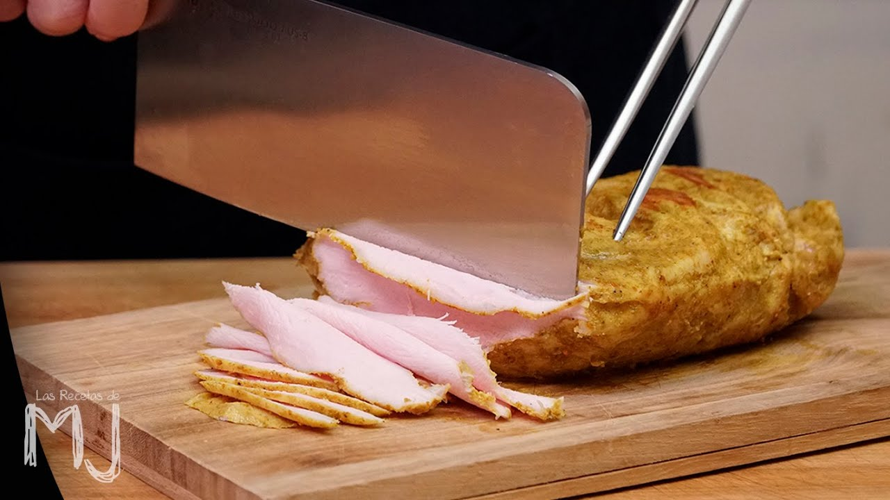

# Fiambre casero de pavo 🍗

## Ingredientes

- 1 litro de agua
- 80 gr de sal
- 350 gr de pechuga de pavo fresca

## Preparación

1. **Preparación de la salmuera:**
   - En una ensaladera grande, hacer una salmuera mezclando el agua y la sal. Remover bien hasta que la sal se disuelva por completo.

2. **Salado del pavo:**
   - Sumergir la pechuga de pavo en la salmuera y dejarla reposar durante 15 minutos[1](#footnote1).

3. **Envoltura y cocción:**
   - Sacar la pechuga de la salmuera, escurrirla y envolverla en papel de aluminio[2](#footnote2).
   - Cocinar la pechuga envuelta en papel de aluminio en una vaporera durante 20 minutos[3](#footnote3). Apagar la vaporera y dejar enfriar durante 10 minutos.

4. **Almacenamiento:**
   - Sacar el pavo del papel de aluminio y guardarlo en un recipiente hermético en la nevera.

## Consumo

- Este fiambre de pavo se conserva en perfecto estado durante aproximadamente una semana.
- Para consumirlo, cortarlo en rodajas finas justo antes de servir.
- Es delicioso con mostaza o como relleno de sándwiches.

#### Fuentes

- [Solomillo de pavo al vapor en salsa de mostaza antigua](http://lasrecetasdefranciscoypablo.blogspot.com/2014/05/solomillo-de-pavo-al-vapor-en-salsa-de.html)
- [Receta de fiambre de pavo, sana y fácil](https://www.youtube.com/watch?v=aeBBStgRObU)
- [La Mejor Receta De Fiambre De Pavo Casero](http://www.galissea.com/la-mejor-receta-de-fiambre-de-pavo-casero/)

##### Notas

- <a name="footnote1">1</a>: Si la pechuga de pavo es de 500 g o más, dejar en la salmuera durante 20 minutos.
- <a name="footnote2">2</a>: Si se preparan varias pechugas, envolver cada una por separado.
- <a name="footnote3">3</a>: Si la pechuga de pavo es de 500 g o más, cocinar durante 30 minutos.
