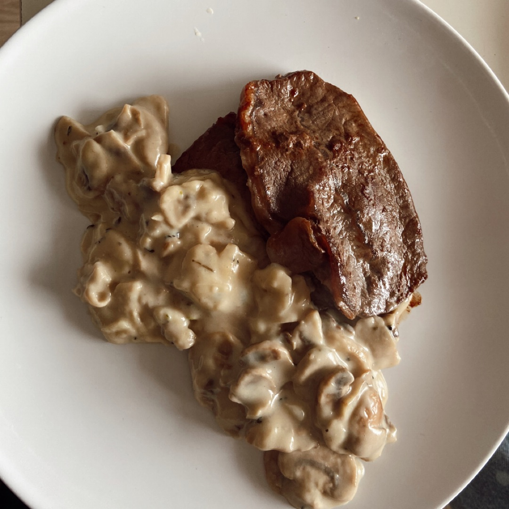

# Filetes sorpresa

## Ingredientes

- 4 filetes de tapa fina
- 4 lonchas de queso
- Queso rallado
- Tacos finos de jamón serrano
- 50 gramos de piñones
- Aceite de oliva
- Sal
- Pimienta
- Perejil picado
- Vino blanco
- Agua (para mojar la cuerda)

## Instrucciones

1. **Preparación de los filetes:**
   - Colocar una loncha de queso sobre cada filete.
   - Distribuir uniformemente sobre cada filete un relleno de jamón serrano, piñones, perejil picado y queso rallado.
   - Enrollar cada filete y atarlos con cuerda de cocina, previamente mojada en agua para evitar que se queme al freír.

2. **Cocción de los filetes:**
   - Calentar aceite de oliva en una sartén a fuego medio.
   - Freír los filetes enrollados en el aceite caliente hasta que estén dorados por todos lados, cuidando de no freír demasiado para mantener la jugosidad.

3. **Preparación de la salsa:**
   - En la misma sartén donde se doraron los filetes, añadir tomate picado o triturado.
   - Agregar los piñones y un chorrito de vino blanco.
   - Cocinar a fuego medio-bajo hasta que la salsa reduzca y tenga una consistencia espesa y sabrosa.

4. **Servir:**
   - Acompañar los filetes con la salsa preparada.
   - Servir junto con puré de papas o la guarnición de tu preferencia.

## Notas

- El amarre con cuerda mojada ayuda a mantener la forma de los filetes durante la cocción.
- Asegúrate de controlar el tiempo de cocción para evitar que los filetes se sequen.
