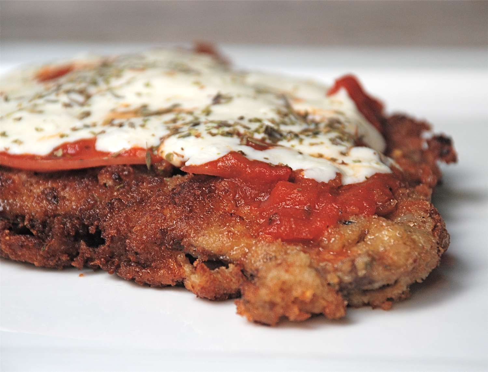

# Milanesas Napolitanas de Pollo o Ternera

## Ingredientes

- Filetes de pollo o ternera (1 o 2 por persona, según el tamaño)
- Pan rallado
- 1 huevo
- Aceite para freír
- Tomate triturado o salsa de tomate con ricota
- Lonchas de queso (mozzarella o similar)
- Rodajas de tomate
- Orégano
- Sal al gusto

## Preparación

1. Salpimentar los filetes de pollo o ternera.

2. Pasar cada filete primero por pan rallado, asegurándose de que estén bien cubiertos.

3. Batir el huevo en un plato hondo y pasar los filetes empanados por el huevo batido.

4. Volver a pasar los filetes por pan rallado para empanarlos por segunda vez.

5. Calentar suficiente aceite en una sartén a fuego medio-alto y freír los filetes empanados hasta que estén dorados y cocidos por dentro. Esto tomará unos 5-7 minutos por cada lado, dependiendo del grosor de los filetes. Retirar y escurrir sobre papel absorbente.

6. Precalentar el horno a 180 grados Celsius (350 grados Fahrenheit).

7. Colocar los filetes dorados en una bandeja para horno.

8. Cubrir cada filete con una capa de tomate triturado o salsa de tomate con ricota.

9. Colocar encima de cada filete unas lonchas de queso y rodajas de tomate.

10. Espolvorear con orégano al gusto.

11. Hornear durante aproximadamente 10 minutos o hasta que el queso esté completamente derretido y burbujeante.

12. Servir caliente, acompañado de ensalada fresca o papas fritas.

## Consejo

- Esta receta es perfecta para aprovechar filetes de pollo o ternera y convertirlos en una comida reconfortante y deliciosa, ideal para cualquier día de la semana.

