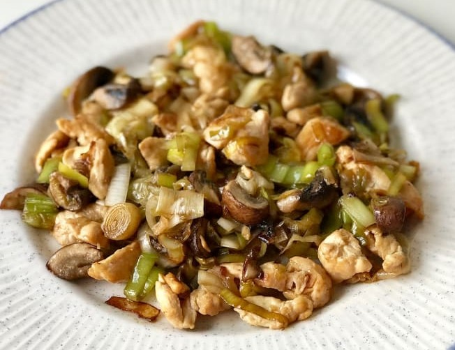

# Pechuga con puerros

## Ingredientes

- Pechugas de pollo
- Puerros (con hojas incluidas)

## Preparación

1. Picar las pechugas en trocitos pequeños y los puerros en trozos menuditos.
2. En un caldero de doble fondo, calentar aceite y añadir las pechugas.
3. Agregar los puerros y cocinar todo a fuego lento hasta que esté bien cocido.

## Notas

- Asegúrate de cortar los puerros finamente para que se cocinen adecuadamente.
- Puedes ajustar el tiempo de cocción según la preferencia de cocción de las pechugas.
