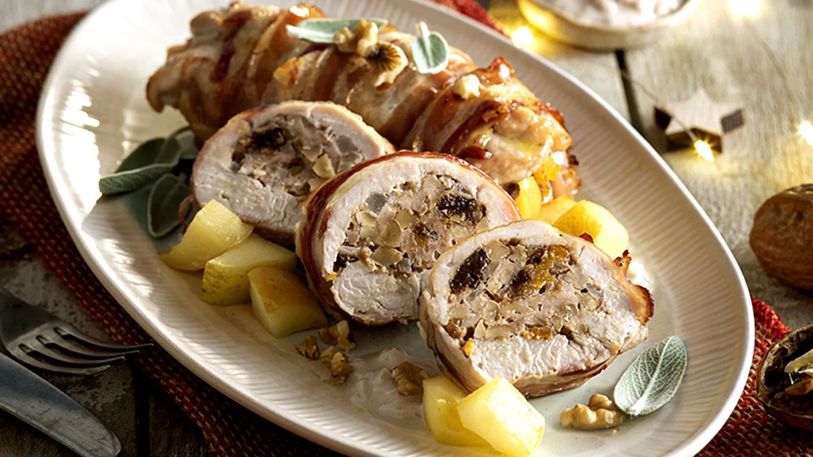

# Pechuga de pavo con nueces

## Ingredientes

- Pechugas de pavo
- Mantequilla
- Ajos
- Salvia
- 100 gramos de nueces
- 2 vasos de leche

## Preparación

1. Trocear las pechugas de pavo.
2. Freír las pechugas con mantequilla, ajos y salvia en una cazuela.
3. Machacar las nueces y añadirlas a la cazuela junto con los 2 vasos de leche.
4. Cocinar a fuego lento durante 50 minutos aproximadamente, hasta que esté bien cocido y la salsa haya reducido.

## Notas

- Asegúrate de cocinar a fuego lento para que las pechugas se cocinen uniformemente.
- Puedes ajustar la cantidad de nueces según tu gusto personal.
- La leche ayuda a crear una salsa cremosa junto con las nueces.
