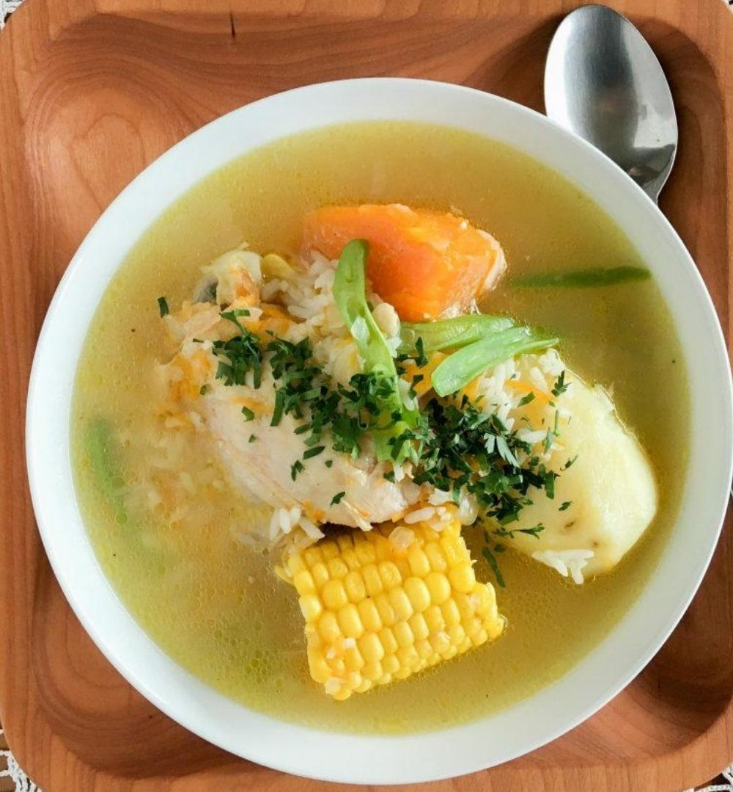

# Pollo a la cazuela

## Ingredientes

- Cazuela de aceite
- Sofrito de cebolla
- Pimiento verde y rojo
- Zanahoria
- Ajo

## Preparación

1. Dorar el pollo con harina.
2. Cuando las verduras estén blandas, añadir el pollo junto con 2 dientes de ajo machacados con perejil y pimiento.
3. Verter un vaso de vino blanco (rosado o cerveza) y otro de agua o caldo.
4. Condimentar con especias al gusto.

## Notas

- Puedes ajustar las especias según tu preferencia.
- El vino blanco o la cerveza le dan un toque especial a esta receta.

## Fuentes

- Adaptado de receta tradicional familiar.
