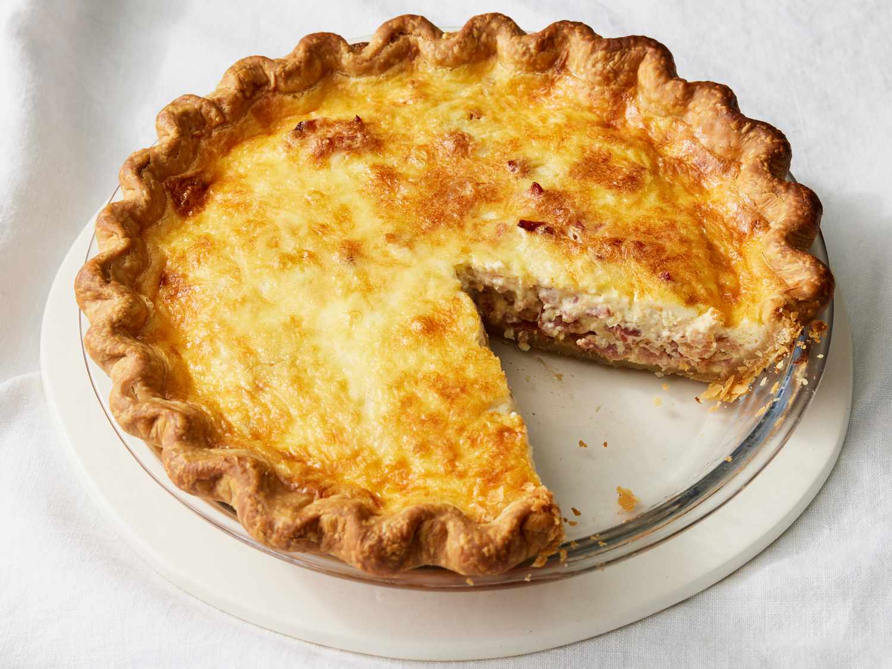

# Quiche Lorraine

## Ingredientes

- 100 gramos de bacon, cortado en finas lonchas
- 100 gramos de queso gruyere rallado
- 3 huevos
- Sal
- Pimienta
- 1 brick (200 ml) de nata para cocinar
- Para la masa quebrada:
  - 150 gramos de harina
  - 90 gramos de mantequilla
  - Sal
  - Agua

## Preparación

### Preparación de la masa quebrada:

1. Coloca la harina sobre una superficie de trabajo en forma de volcán.
2. Distribuye encima la mantequilla en trozos y añade un poco de sal.
3. Agrega 2-3 cucharadas de agua al centro.
4. Amasa la mezcla hasta que la masa esté ligada, evitando trabajarla en exceso.
5. Forma una bola con la masa y déjala reposar en el refrigerador durante 30 minutos.
6. Extiende la masa con un rodillo y forra un molde para tarta previamente engrasado. Pincha la base con un tenedor.
7. Precocina la masa en el horno precalentado a 180°C durante 8 minutos.

### Preparación del relleno:

1. Corta el bacon en trozos y fríelos ligeramente en una sartén sin aceite.
2. En un bol, bate los huevos y añade la nata, el queso rallado, sal y pimienta al gusto. Mezcla bien.
3. Incorpora el bacon frito a la mezcla de huevos y nata.
4. Vierte esta mezcla sobre la masa precocida en el molde para tarta.

### Horneado:

1. Hornea la quiche en horno moderado a 180°C durante 15-20 minutos, o hasta que esté dorada y cuajada.
2. Retira del horno y deja enfriar un poco antes de servir.

## Notas

- La Quiche Lorraine es ideal para servir como plato principal o acompañada de una ensalada verde.
- Puedes ajustar la cantidad de queso y bacon según tu preferencia.
- Asegúrate de precocinar la masa para evitar que se humedezca con el relleno durante el horneado.
