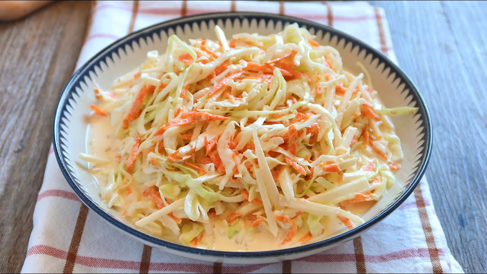

# Ensalada Americana o de Col

## Ingredientes

- 100 g de repollo
- 100 g de manzana Golden
- 75 g de zanahoria

### Para la salsa:

- 2 cucharadas de leche desnatada
- Unas gotas de zumo de limón
- 1/2 cucharada de mayonesa light
- 1/2 cucharada de mostaza de Dijón
- 2 cucharadas de vinagre de vino o de manzana
- 1/2 cucharada de azúcar
- Una pizca de sal
- Nueces (para decorar)

## Elaboración

1. **Preparación de la salsa:**
   - En un vaso de cristal, combina la leche desnatada con unas gotas de zumo de limón para cortar la leche (simulando el efecto del yogur).
   - Añade la sal y el azúcar, mezcla bien.
   - Incorpora la mayonesa light, la mostaza de Dijón y el vinagre de vino o de manzana. Mezcla todo con una cucharilla hasta obtener una salsa homogénea. Deja reposar mientras preparas los ingredientes.

2. **Preparación de la ensalada:**
   - Corta finamente el repollo.
   - Corta la manzana en cubos o tiras finas.
   - Ralla la zanahoria.

3. **Montaje:**
   - En un bol grande, mezcla el repollo, la manzana y la zanahoria.
   - Agrega la salsa preparada y mezcla bien para que todos los ingredientes se impregnen.
   - Decora con nueces antes de servir.

## Notas

- La Ensalada Americana o de Col es ideal como entrante fresco y saludable.
- Puedes ajustar la cantidad de salsa según tu preferencia personal de cremosidad.
- Sirve la ensalada fría para mejor sabor y frescura.
