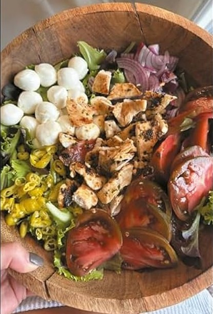

# Ensalada al estilo Ale Agullo I

## Ingredientes

- Mezcla de lechugas (cualquier bolsa de ensaladas preparadas)
- 1/2 cebolla roja
- Piparras (al gusto)
- 1 tomate rosa grande
- Bolas de mozzarella (1 paquete de bolas pequeñas)
- Filete de pollo a la plancha (del día anterior o pollo asado troceado)

- Sal
- Aceite de oliva
- Vinagre de Módena

## Preparación

1. En un bol grande, colocar la mezcla de lechugas.

2. Cortar la cebolla roja en rodajas finas y añadirla al bol junto con las piparras.

3. Cortar el tomate rosa en rodajas o trozos y agregarlo a la ensalada.

4. Añadir las bolas de mozzarella al bol.

5. Trocear el filete de pollo a la plancha en tiras o cubos y agregarlo a la ensalada.

6. Aliñar la ensalada con sal al gusto, un buen chorro de aceite de oliva y vinagre de Módena.

7. Mezclar bien todos los ingredientes para que se integren los sabores.

8. Servir y disfrutar esta ensalada ideal para aprovechar sobras de pollo del día anterior.

## Consejo

- Esta ensalada es perfecta para cuando tienes sobras de la cena anterior y quieres evitar desperdiciar comida.
