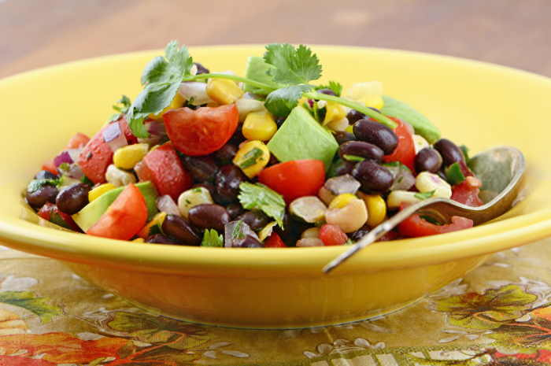

# Ensalada Paraguaya con Aderezo de Yogur

## Ingredientes

- 1 calabacín, cortado en cubitos
- 1 lata de piña en rodajas, escurrida y cortada en trozos
- 1 lata de melocotón en almíbar, escurrido y cortado en trozos
- 10 palitos de cangrejo, picados
- 1 lata de maíz dulce, escurrido
- 1 aguacate, cortado en cubos
- Mayonesa, al gusto

## Aderezo de Yogur

- 1/2 taza de yogur natural
- 1 cucharada de jugo de limón
- 1 cucharadita de miel
- Sal y pimienta al gusto

## Instrucciones

1. **Preparación de los ingredientes:**
   - Corta el calabacín en cubitos pequeños.
   - Corta la piña y el melocotón en trozos.
   - Pica los palitos de cangrejo en trozos pequeños.
   - Corta el aguacate en cubos.

2. **Ensalada:**
   - En un bol grande, combina el calabacín, la piña, el melocotón, los palitos de cangrejo, el maíz dulce y el aguacate.

3. **Aderezo de Yogur:**
   - En un recipiente pequeño, mezcla el yogur natural con el jugo de limón y la miel. Añade sal y pimienta al gusto y mezcla bien.

4. **Mezcla y aliña:**
   - Vierte el aderezo de yogur sobre la ensalada y mezcla suavemente para cubrir todos los ingredientes con el aderezo.

5. **Servir:**
   - Sirve la ensalada paraguaya con aderezo de yogur inmediatamente.

## Notas

- Esta ensalada es refrescante y llena de sabores tropicales gracias a la piña, el melocotón y el aguacate.
- Puedes ajustar la cantidad de mayonesa según tu preferencia para darle más cremosidad a la ensalada.
- Es ideal para acompañar platos principales o como plato único ligero.
- Se conserva bien en el refrigerador por un día, pero es mejor consumirla el mismo día para disfrutar de su frescura.

¡Disfruta de esta deliciosa ensalada paraguaya con el refrescante aderezo de yogur! 🥗🍍
