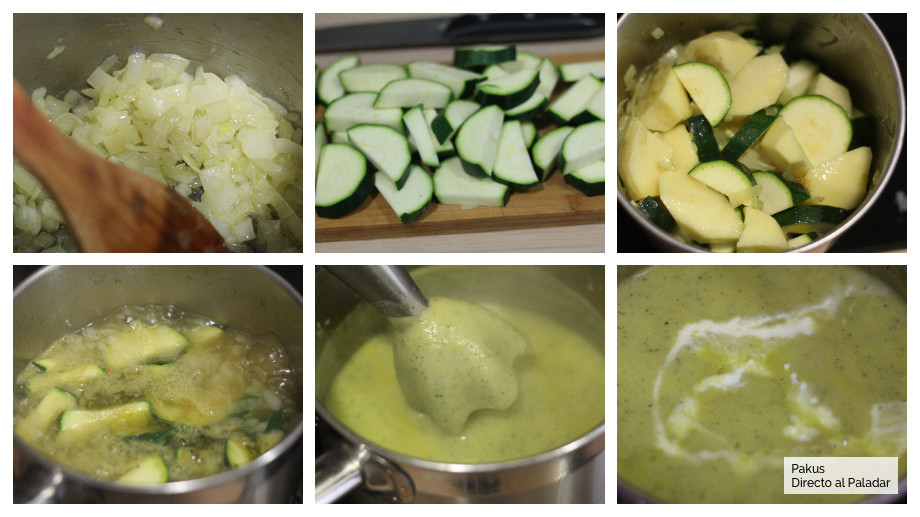

# Crema de calabacín

## Descripción

La crema de calabacín es una opción ideal para una cena saludable. Es una receta ligera, saciante y baja en calorías, perfecta para disfrutar de una comida nutritiva sin remordimientos.

## Ingredientes

* 2 calabacines
* 1 patata
* Media cebolla
* 500 ml de caldo de verduras
* Sal y pimienta al gusto
* Aceite de oliva virgen extra
* 30 ml de nata líquida
* 1 diente de ajo (opcional)

## Preparación

1. Cortar la cebolla en juliana y sofreír en una cazuela con un poco de aceite de oliva. Opcionalmente, añadir también un diente de ajo pelado. Pochamos la cebolla a fuego lento para que no tome mucho color.
2. Mientras tanto, picar los calabacines sin pelar, y pelar y cortar las patatas en trozos irregulares.
3. Cuando la cebolla esté pochada, añadir el calabacín picado y las patatas a la cazuela. Sofreír ligeramente durante unos diez minutos.
4. Añadir el caldo de verduras y dejar cocer a fuego lento otros 20 minutos.
5. Triturar con la batidora o pasar la crema por el pasapurés.
6. Reintegrar la crema a la cazuela y rectificar de sal y pimienta. Añadir la nata líquida y cocer otros cinco minutos más.

## Notas

> Nota: Podéis servir la crema de calabacín acompañada de unos taquitos de jamón, picatostes de pan o espolvoreada con un poco de pimienta y una cucharada de queso rallado en cada plato. Es una receta que gusta tanto a grandes como a pequeños.