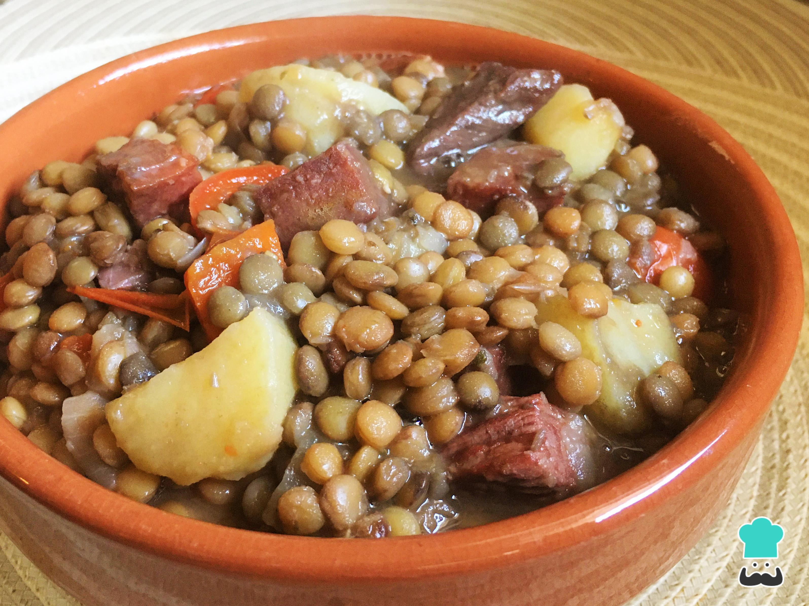

# Guiso de lentejas

## Ingredientes

* Aceite de girasol
* Cebolla
* Tomates
* Carne (primo)
* Lentejas
* Arroz
* Pimentón
* Sal, a gusto
* Pimienta blanca, a gusto
* Chorizo colorado (parrillero)
* Zanahorias
* Papa
* Ancos coreanos o zapallo amarillo (pueden ser ambos)

## Preparación

1. Poner a remojar la cantidad de lentejas a utilizar en agua que duplique su volumen, preferiblemente desde la noche anterior o por varias horas.
2. Picar la cebolla muy finamente y cocinar en una cucharada de aceite de girasol caliente hasta que esté transparente.
3. Mientras se cocina la cebolla, cortar la carne en cubos medianos.
4. Hervir agua y cocinar los chorizos hasta que estén listos.
5. Una vez que la cebolla esté lista, agregar la carne y sellarla. Incorporar los tomates picados o procesados.
6. Cortar las verduras en cubos y hervir aproximadamente un litro de agua en una olla aparte.
7. Añadir sal, pimentón y pimienta blanca al gusto a la preparación de tomate y carne. Si es necesario, agregar agua hervida para evitar que la mezcla se pegue.
8. Continuar cocinando a fuego medio hasta que la carne esté tierna y las verduras estén cocidas.

## Notas

> Nota: Asegúrate de controlar el nivel de líquido durante la cocción para evitar que el guiso se seque o se pegue al fondo de la olla.
