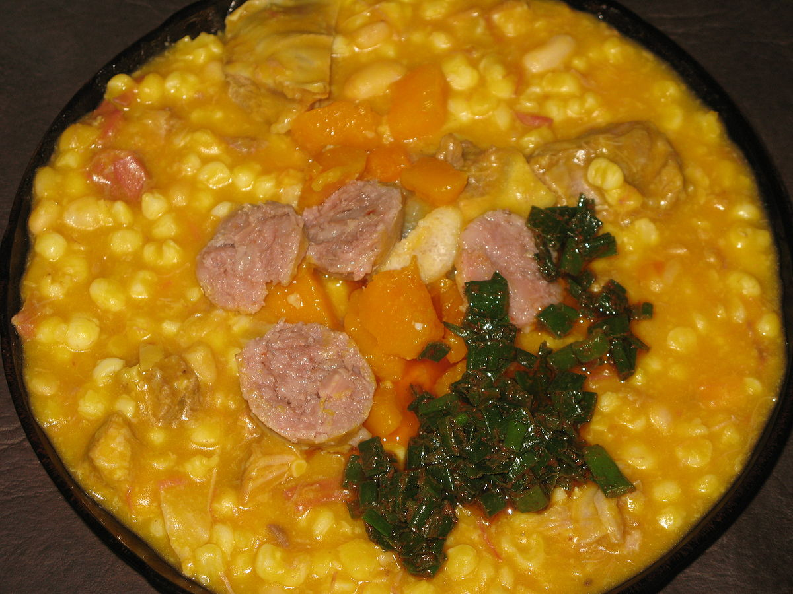

# Locro

Para unas 5 o 6 personas.

## Ingredientes

* 500g de maíz blanco pisado
* 200-250g de garbanzos
* 200-250g de porotos blancos
* 1 calabaza mediana o chica
* Chorizo colorado de buena calidad
* Chorizo Blanco (cantidad a gusto)
* Trozo de carne vacuna (roas beef, bife ancho, falda, etc.)
* Trozo de carne de cerdo con hueso y grasa (rabito o espinazo son ideales)
* Cebolla de verdeo
* Aceite de cocina
* Ajo
* Ají molido
* Pimentón
* Sal al gusto
* Pan y vino para acompañar

## Preparación

1. Enjuagar bien los granos (maíz, garbanzos, porotos) y dejar remojando desde el día anterior.
   
2. En una cacerola aparte, hervir las carnes y chorizos en un hervor rápido y fuerte para blanquearlos un poco. Descartar el caldo.

3. En una cacerola grande, poner a hervir los granos con poca agua (se puede usar el agua del remojo si está limpia).

4. Una vez que hierva, reducir el fuego al mínimo.

5. Lavar bien la calabaza, cortarla por la mitad, quitar las semillas y agregarla al grano cortada en trozos con cáscara.

6. Agregar agua hirviendo a medida que sea necesario, revolviendo de vez en cuando para evitar que el locro se pegue al fondo. El nivel de agua debe ser ajustado para que el locro no quede ni demasiado seco ni muy líquido.

7. Añadir las carnes previamente hervidas y los chorizos enteros a la preparación.

8. Cocinar a fuego lento durante aproximadamente 2-3 horas, hasta que los granos estén tiernos y la calabaza se haya deshecho. La carne debería deshacerse fácilmente.

9. Para servir, cortar los chorizos en rodajas.

10. Rectificar la sazón con sal al gusto antes de servir, si es necesario.

## Notas

> Nota: El locro es un plato que requiere paciencia y cuidado en la cocción para lograr la textura y sabor adecuados. Es importante mantener un ojo en el nivel de líquido durante la cocción para evitar que se pegue.
