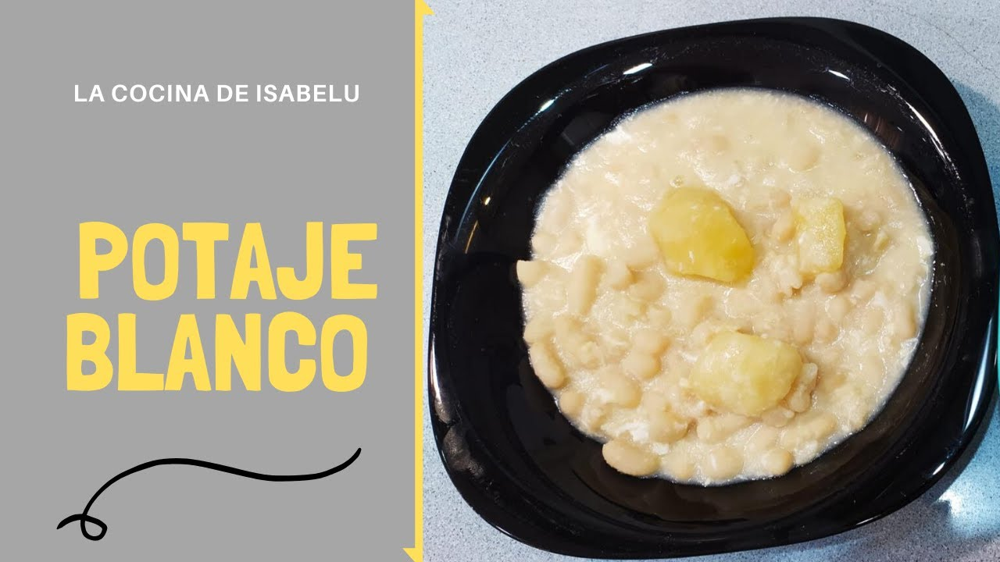

# Potaje blanco

## Ingredientes

* Aceite de cocina
* Dientes de ajo
* Azafrán
* Calabacín (1 o 2 unidades)
* Cebolla (1 unidad)
* Huevos (4 unidades)
* Guisantes
* Papas
* Pimiento (1/2 unidad, verde o rojo)
* Perejil

## Preparación

1. Poner agua al fuego con aceite, sal, una cebolla picada y medio pimiento rojo o verde, machacados con dientes de ajo. Cocinar a fuego medio durante 5 minutos.
   
2. Añadir las papas previamente troceadas, el calabacín (bubango), y los guisantes.

3. Incorporar el perejil y el azafrán al gusto.

4. Romper los huevos uno por uno en una taza y mezclar ligeramente sin batirlos.

5. Verter los huevos en el potaje y darles unas vueltas suaves para distribuirlos.

6. Cocinar durante 5 minutos adicionales a fuego medio.

7. Servir caliente.

## Notas

> Nota: Se puede añadir también trozos de bubango y guisantes, usando solo 1 huevo si se prefiere una versión más ligera del plato.
