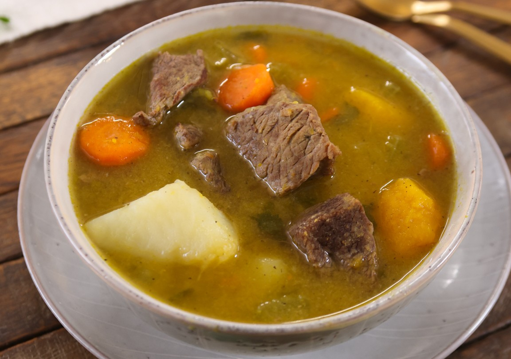

# Sopa de carne

## Ingredientes

* 2 huesos de rodilla
* 1 trozo de carne para caldo (aprox. 150 g)
* 1 hueso de jamón
* Verduras al gusto (zanahoria, cebolla, puerro)
* Menudos de pollo (opcional)

## Preparación

1. En una olla grande, poner los huesos de rodilla, el trozo de carne para caldo y el hueso de jamón.
   
2. Agregar suficiente agua para cubrir los ingredientes y llevar a ebullición.

3. Cocinar a fuego medio durante aproximadamente 1 hora, retirando la espuma que se forma en la superficie.

4. Agregar las verduras picadas (zanahoria, cebolla, puerro) y los menudos de pollo, si se desea.

5. Cocinar a fuego lento durante otra hora o hasta que la carne esté tierna y las verduras estén cocidas.

6. Retirar los huesos y la carne de la olla. Desmenuzar la carne y desechar los huesos y restos.

7. Servir caliente.

## Notas

> Nota: Puedes ajustar las verduras según tu preferencia. Esta sopa es excelente como entrada o plato principal ligero.

