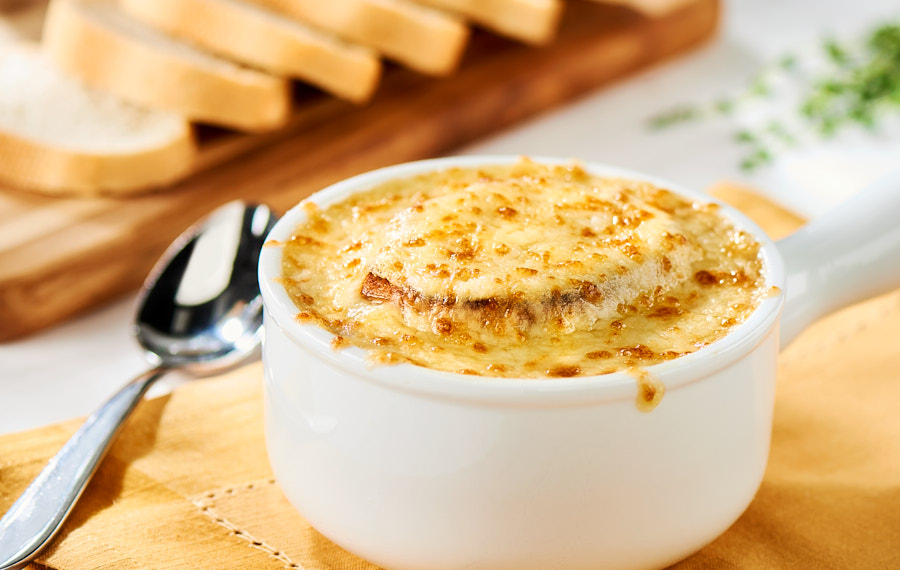

# Sopa de cebolla

## Ingredientes

* Aceite de cocina
* Cebollas (cantidad según preferencia, cortadas en rodajas finas)
* Mantequilla
* Pan (rebanadas para tostar)
* Queso (para gratinar)
* Vino blanco
* Sal al gusto

## Preparación

1. En una olla grande, calentar un poco de aceite de cocina y mantequilla.

2. Freír las rodajas de cebolla hasta que estén doradas y caramelizadas.

3. Añadir aproximadamente 1 litro de agua y el vino blanco a la olla con la cebolla. Cocinar a fuego medio durante unos 20 minutos. Sazonar con sal al gusto.

4. Mientras tanto, tostar las rebanadas de pan.

5. Colocar las rebanadas de pan tostado en una fuente para horno. Verter encima el caldo caliente con las cebollas.

6. Cubrir generosamente con queso y gratinar en el horno hasta que el queso se derrita y se dore.

7. Servir caliente.

## Notas

> Nota: Esta sopa de cebolla es ideal como entrante o plato principal ligero. El tiempo de cocción puede variar según la intensidad del fuego y la preferencia de caramelización de las cebollas.
