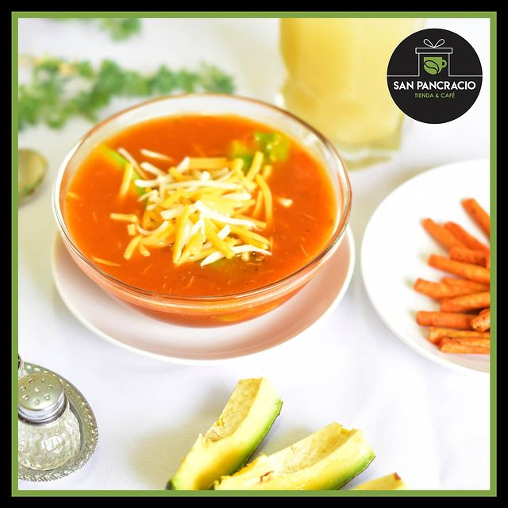

# Sopa de San Pancracio

## Ingredientes

* Aceite de cocina
* 2 tomates
* 1 cebolla
* Ajo al gusto
* Sal al gusto
* Papas
* Arroz
* Agua

## Preparación

1. Picar los tomates, la cebolla y el ajo.

2. En una olla grande, calentar un poco de aceite de cocina y freír el tomate, la cebolla y el ajo hasta que estén dorados.

3. Añadir agua suficiente para cubrir los ingredientes y llevar a ebullición.

4. Agregar las papas cortadas en trozos y el arroz.

5. Cocinar a fuego medio hasta que las papas y el arroz estén cocidos y tiernos, aproximadamente 30 minutos.

6. Retirar del fuego y pasar la sopa por una batidora o mini-pimer hasta obtener una textura cremosa.

7. Rectificar la sazón con sal si es necesario.

8. Servir caliente.

## Notas

> Nota: Esta sopa es conocida como "Sopa de San Pancracio" y es una opción reconfortante como plato principal. Puedes ajustar la cantidad de agua según la consistencia deseada.
