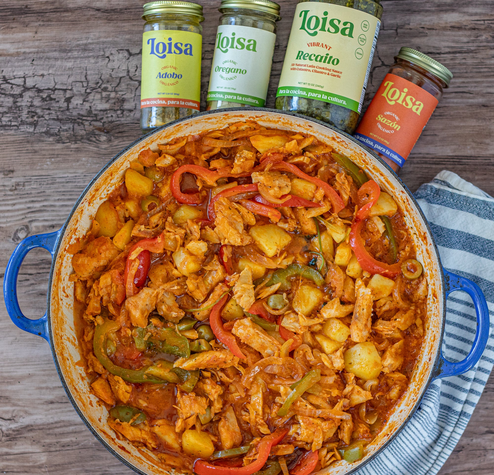

# Bacalao

## Ingredientes

* Bacalao desalado
* Cebolla
* Ajo
* Pimientos del piquillo (de lata o bote)
* Pimentón dulce
* Agua

## Instrucciones

Hervir el bacalao durante 3 minutos (importante no pasarse).

Picar la cebolla en juliana y dejarla pochar junto con los dientes de ajo en una sartén.

Cortar los pimientos del piquillo en rodajas y añadir a la cebolla pochada. Agregar una cucharada de pimentón dulce.

Usar el agua de la cocción del bacalao para añadir a la mezcla de cebolla y pimientos.

Colocar el bacalao en una cazuela ancha con cuidado y cubrirlo con la mezcla de cebolla y pimientos. Añadir el caldo, asegurándose de no hervir más.

## Notas

> Nota: Asegúrate de no hervir el caldo una vez añadido para evitar que el bacalao se deshaga.

## Fuentes

* Receta personal

## Referencias

N/A
