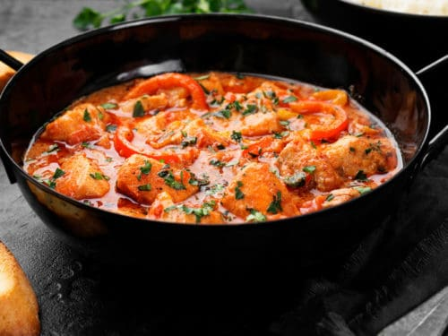

# Cazuela de Pescado

## Ingredientes

* Aceite
* Ajo
* Cebolla
* Pimiento
* Tomate
* Pescado (preferiblemente de carne firme como merluza, pargo, etc.)

## Instrucciones

1. **Preparación del Pescado:**
   - Trocear el pescado y freír ligeramente en una cazuela con aceite caliente.

2. **Preparación del Sofrito:**
   - En la misma cazuela, con el aceite restante, agregar la cebolla, pimiento y tomate. Sofreír hasta que estén dorados.

3. **Cocción del Pescado:**
   - Añadir el pescado al sofrito y cubrir con agua. Dejar hervir a fuego medio hasta que el pescado esté cocido.

4. **Preparación de las Papas o Arroz:**
   - Mientras el pescado hierve, cocinar papas o arroz por separado según las preferencias.

5. **Preparación del Caldo de Cabeza y Ventrisca:**
   - En una sartén aparte, freír ligeramente la cabeza y la ventrisca del pescado.
   - Llevar a una olla con abundante agua, sal y cilantro. Hervir durante media hora para obtener un caldo sabroso.

6. **Finalización de la Cazuela:**
   - Retirar el pescado cocido de la cazuela principal y reservar en una fuente.
   - Colar el aceite del pescado y usarlo para freír ajo y azafrán en otra sartén.
   - Incorporar este sofrito al caldo de cabeza y ventrisca.
   - Añadir las papas o arroz cocidos y troceados al caldo junto con el pescado reservado.
   - Dejar hervir todo junto durante unos 15 minutos más para que los sabores se integren.

## Notas

> Asegúrate de controlar el tiempo de cocción del pescado para evitar que se deshaga. El cilantro y el azafrán añaden un toque distintivo a este plato.

