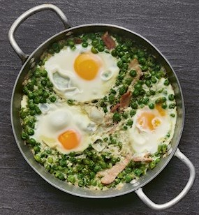

# Colchón de Arvejas

Receta rica, rendidora y fácil de preparar.

## Ingredientes

* 2 cebollas
* 1 morrón rojo
* Aceite (para rehogar)
* Sal, pimienta, ají molido, orégano (a gusto)
* 2-3 dientes de ajo, alternativos (cantidad necesaria)
* 1 lata de tomates perita (cubeteados) o tomate cubeteado
* 2 latas de arvejas
* 1 paquete de salchichas (6 unidades)
* 1 huevo por comensal (o más si son golosos)

## Procedimiento

1. **Preparación de la Salsa:**
   - Pelar y cortar las cebollas y el morrón en trozos medianos.
   - En una olla grande, calentar aceite y rehogar las cebollas y morrón hasta que estén dorados.
   - Agregar los tomates perita (o tomate cubeteado) y cocinar por unos minutos.
   - Condimentar con sal, pimienta, ají molido, orégano y ajo picado o en rodajas. Cocinar por unos minutos más.
   - Agregar uno o dos vasos de agua y dejar reducir a fuego medio durante 25-40 minutos, hasta obtener una salsa espesa pero no demasiado.

2. **Incorporación de Arvejas y Salchichas:**
   - Agregar las arvejas escurridas y las salchichas cortadas en rodajas a la olla con la salsa. Revolver suavemente para mezclar.
   - Reducir el fuego al mínimo.

3. **Cocción de los Huevos:**
   - Romper los huevos uno por uno y colocarlos con cuidado sobre la superficie de la mezcla en la olla, sin que se hundan.
   - Espolvorear un poco de sal sobre los huevos.
   - Tapar la olla y cocinar a fuego bajo hasta que las claras de huevo estén cocidas y los huevos estén listos (aproximadamente 5-7 minutos).

4. **Servir:**
   - Con ayuda de una espumadera, servir el Colchón de Arvejas, asegurándote de colocar los huevos sobre la superficie de cada plato para una presentación atractiva.

## Notas

> Ajusta la cantidad de huevos y salchichas según el número de comensales. La cocción de los huevos debe hacerse con cuidado para evitar que se rompan antes de que las claras estén completamente cocidas.

