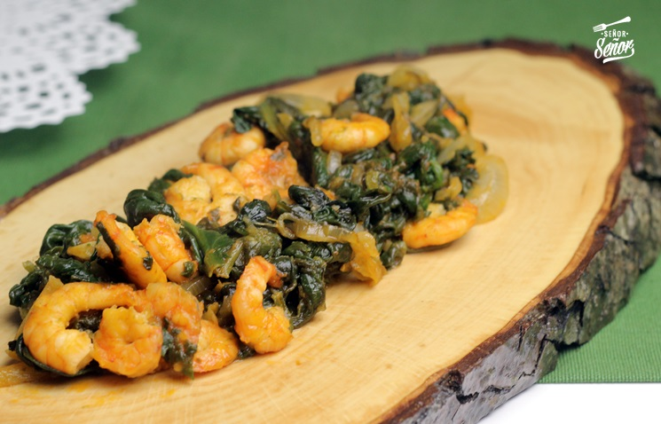

# Pescado en Salsa y Guisantes

## Ingredientes

* Aceite
* Cebolla
* Guisantes
* Harina
* Rodajas de pescado o filetes (de tu elección)
* Vino blanco

## Procedimiento

1. **Preparación:**
   - Calentar aceite en una olla grande.
   - Añadir ajo picado, sal y perejil al gusto.

2. **Elaboración de la Salsa:**
   - Agregar harina y cocinar hasta que tome color.
   - Incorporar ajo machacado con un poco de vino blanco y un vasito de agua. Revolver bien para formar la base de la salsa.

3. **Cocción del Pescado y los Guisantes:**
   - Colocar las rodajas de pescado o filetes en la olla junto con los guisantes.
   - Tapar la olla y cocinar a fuego medio-bajo durante el tiempo necesario, hasta que el pescado esté cocido y los guisantes estén tiernos.

4. **Servir:**
   - Servir el Pescado en Salsa y Guisantes caliente, acompañado de arroz o patatas al gusto.

## Notas

> Asegúrate de ajustar el tiempo de cocción según el grosor del pescado y la textura deseada de los guisantes. El vino blanco aporta un sabor característico a la salsa, asegúrate de usarlo con moderación para no dominar el plato.
