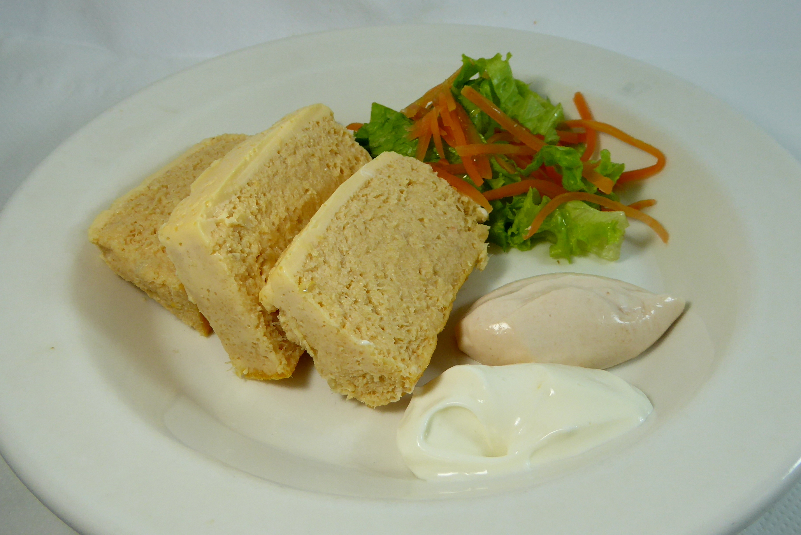

# Pudín de Pescado

## Ingredientes

* Merluza (500 g, sin piel ni espinas)
* Gambas (200 g, peladas)
* Mayonesa (cantidad necesaria)

## Procedimiento

1. **Preparación de los Ingredientes:**
   - Cocinar la merluza al vapor o hervirla hasta que esté completamente cocida.
   - Cocinar las gambas en agua con sal hasta que estén rosadas y completamente cocidas. Escurrir y reservar.

2. **Preparación del Pudín:**
   - En un procesador de alimentos, triturar la merluza cocida y las gambas hasta obtener una mezcla homogénea.
   - Agregar mayonesa suficiente para ligar la mezcla y obtener una consistencia adecuada para formar el pudín.

3. **Moldeado y Refrigeración:**
   - Colocar la mezcla en un molde engrasado con aceite o forrado con papel film.
   - Alisar la superficie con una espátula.
   - Refrigerar durante al menos 30 minutos para que tome forma.

4. **Servir:**
   - Desmoldar con cuidado el pudín de pescado sobre un plato de presentación.
   - Decorar al gusto con unas hojas de lechuga, rodajas de limón o salsa tártara.

## Notas

> Este Pudín de Pescado es ideal como entrante frío para ocasiones especiales. Ajusta la cantidad de mayonesa según la textura deseada para el pudín.
