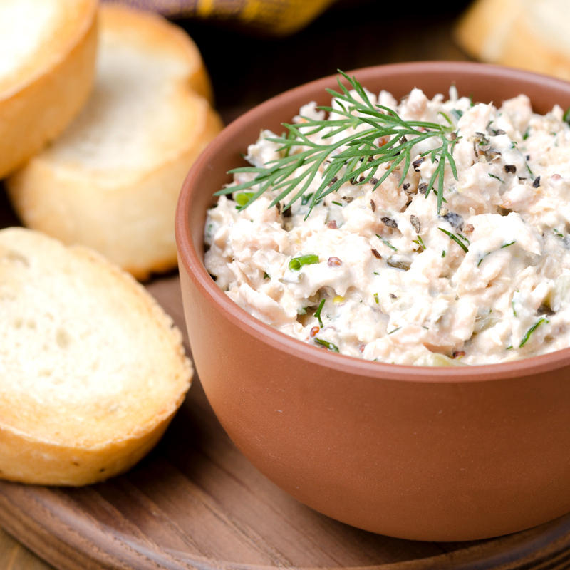

# Rilletes de Sardinas 🐟

## Ingredientes

- 3 latas de sardinas en aceite (preferiblemente de oliva)
- 1 cucharada sopera de alcaparras en salmuera o un puñado de aceitunas verdes
- Unas hojitas de romero fresco
- Unas hojitas de tomillo fresco
- Zumo de medio limón
- Unas tiras de piel de limón
- Un chorrito de vino blanco o vinagre suave (como de arroz)
- Sal al gusto
- 1 cucharada de café de mantequilla

## Preparación

1. Con un tenedor, aplasta las sardinas y mézclalas con el aceite de 2 de las latas.
2. Añade el romero, el tomillo, las alcaparras (o aceitunas picadas), la sal y mezcla bien.
3. Incorpora la mantequilla y mezcla nuevamente.
4. Agrega el zumo de limón y el chorrito de vino blanco (o vinagre suave) y mezcla hasta integrar todos los ingredientes.
5. Transfiere la mezcla a un tarro con tapa adecuado.
6. Coloca las tiras de piel de limón por encima y cubre completamente con el aceite de la tercera lata de sardinas para evitar la oxidación. Añade aceite de oliva si es necesario para cubrir completamente.

## Conservación

El tarro debe quedar completamente cubierto de aceite y bien cerrado (con tapa de rosca u similar). Se puede conservar en la nevera hasta por una semana.

#### Fuentes

- Carta del [restaurante La Minoterie](https://laminoterie.es/)
- [Directo al Paladar - Rilletes de Sardinas](https://www.directoalpaladar.com/recetas-de-aperitivos/rillette-de-sardinas-receta)
