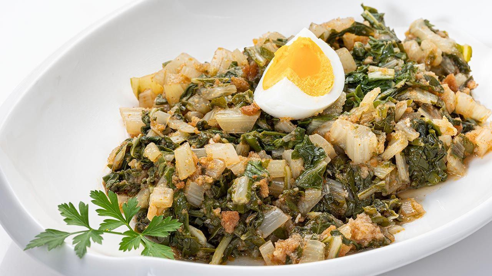

# Acelgas en Adobo

## Ingredientes:

- 2 cucharadas de vinagre
- Aceite
- 3 dientes de ajo
- Pan remojado

## Preparación:

1. Picar en dados los ajos y el pan. Cocer en agua con sal. Luego, escurrir.

2. En el aceite, dorar los 3 dientes de ajo. Cuando estén dorados, machacar en un mortero con un poco de pan previamente remojado en vinagre.

3. En el mismo aceite, añadir pimientos. Agregar la mezcla del mortero junto con las acelgas y sofreír todo junto un poco.

4. Servir en una bandeja y decorar con huevos duros cortados.
