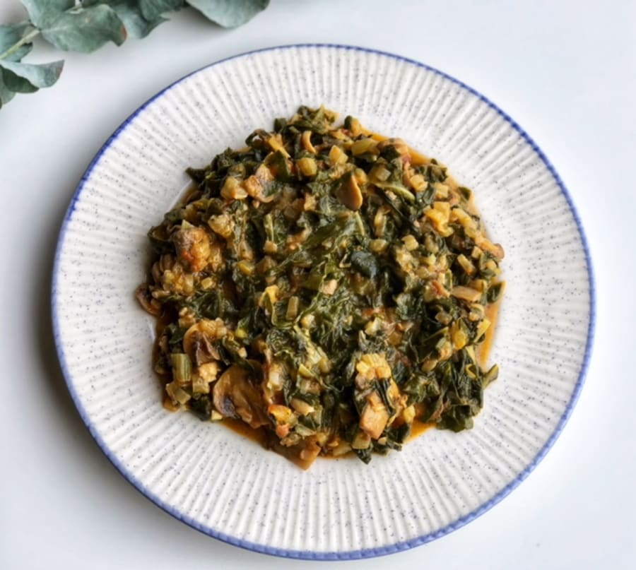

# Acelgas Guisadas

## Ingredientes:

- Acelgas
- 3 dientes de ajo
- Huevos
- Miga de pan
- Pimentón
- Pimiento
- Sal
- Vinagre

## Preparación:

1. Picar las acelgas y guisarlas con sal.

2. Remojar la miga de pan con vinagre.

3. Freír ligeramente 3 dientes de ajo enteros. Apartarlos y machacarlos en un mortero con 3 granos de pimienta negra.

4. En el aceite de los ajos, freír un poco de pimiento (en poca cantidad).

5. Mezclar la miga de pan con el contenido del mortero.

6. En el caldero de las acelgas, mezclar todo (aceite con pimentón, pan, ajo y pimiento).

7. Picar un par de huevos duros y esparcir por encima. Se puede mezclar con papas fritas.
