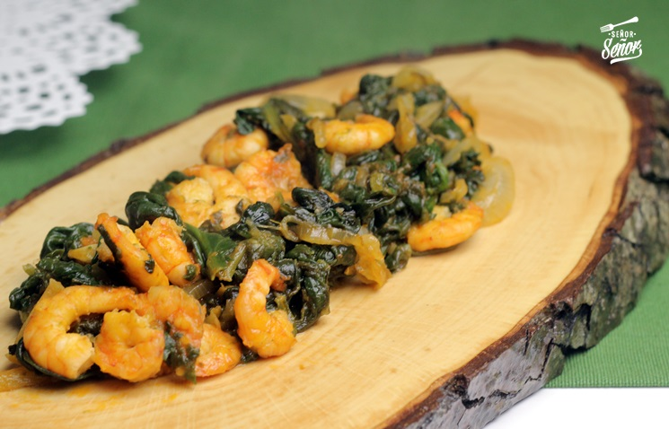

# Espinacas con Gambas

## Ingredientes:

- Espinacas
- Gambas peladas
- 2 cucharadas de nata líquida
- Sal al gusto

## Preparación:

1. Guisar las espinacas con sal al gusto, luego escurrirlas.

2. En una sartén, poner las espinacas guisadas y añadir 2 cucharadas de nata líquida. Rehogar ligeramente.

3. En la misma sartén, pasar las gambas peladas muy brevemente hasta que estén cocidas. Mezclar las gambas con las espinacas.

4. Servir caliente y disfrutar de este delicioso plato de espinacas con gambas.
