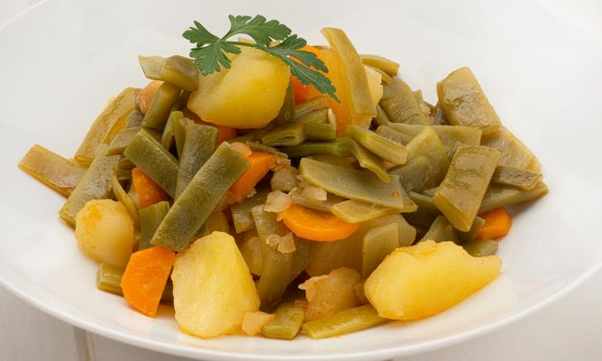

# Judías Verdes con Papas y Zanahorias

## Ingredientes:

- Ajos
- Judías verdes
- Papas
- Zanahorias
- Aceite de oliva
- Sal al gusto

## Preparación:

1. Cocer las judías verdes en agua con sal hasta que estén tiernas, añadiendo las zanahorias cortadas en rodajas durante los últimos minutos de cocción.

2. Mientras tanto, pelar las papas y cortarlas en cubos pequeños.

3. En una sartén, calentar un poco de aceite de oliva y freír los ajos picados hasta que estén dorados.

4. Agregar las papas a la sartén y cocinar hasta que estén doradas y tiernas.

5. Escurrir las judías verdes y zanahorias, y añadir a la sartén con las papas y los ajos. Saltear todo junto durante unos minutos para mezclar bien los sabores.

6. Rectificar la sal si es necesario y servir caliente como plato principal.

¡Disfruta de estas judías verdes con papas y zanahorias, un plato nutritivo y delicioso!
