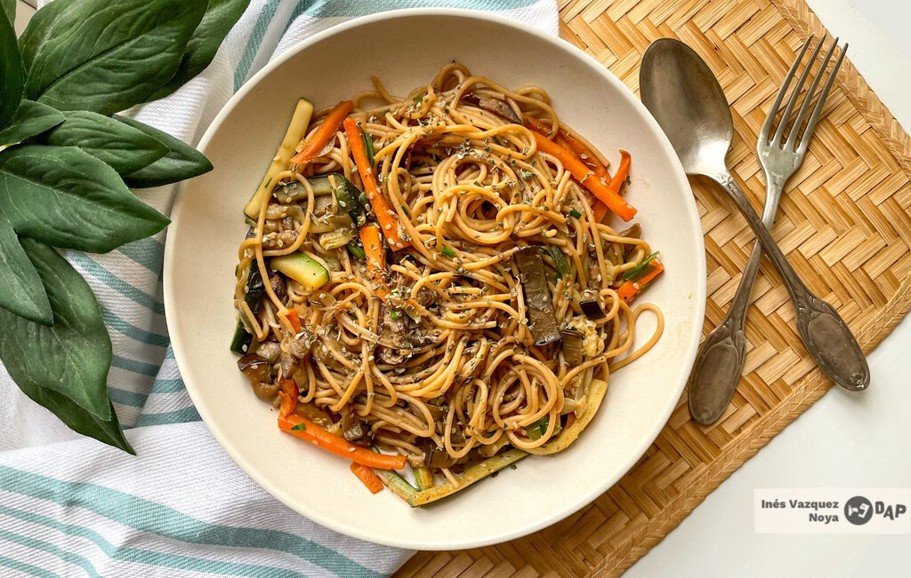

# Verduras con Pasta

## Ingredientes:

- Mantequilla
- Pasta de risos
- Pimiento rojo y verde, cortados en trozos
- Puerro, cortado en rodajas
- Queso (preferiblemente queso rallado o en trozos pequeños)
- Salsa de tomate
- Zanahoria, cortada en rodajas finas
- Sal y pimienta al gusto
- Opcional: carne de soja (para añadir proteína vegetal)

## Preparación:

1. Cocinar la pasta en agua hirviendo con sal según las instrucciones del paquete. Escurrir y reservar.

2. En una sartén grande, derretir un trozo de mantequilla a fuego medio. Añadir las zanahorias y las verduras (excepto el puerro) y saltearlas hasta que estén tiernas, aproximadamente 8-10 minutos.

3. Si estás utilizando carne de soja, añádela a la sartén junto con las verduras y cocina hasta que esté dorada y cocida.

4. Agregar el puerro cortado a la sartén y cocinar por unos minutos más hasta que esté tierno.

5. Incorporar la salsa de tomate a las verduras en la sartén. Mezclar bien para combinar todos los ingredientes. Rectificar la sazón con sal y pimienta según sea necesario.

6. Agregar la pasta cocida a la sartén con las verduras y la salsa de tomate. Mezclar suavemente para cubrir la pasta con la salsa.

7. Espolvorear generosamente queso rallado o en trozos por encima de la pasta y las verduras en la sartén.

8. Cortar unos trozos pequeños de mantequilla y distribuirlos sobre la superficie de la pasta y las verduras.

9. Tapar la sartén y cocinar a fuego lento durante unos minutos más, hasta que el queso se derrita y todos los ingredientes estén bien combinados.

10. Servir caliente y disfrutar de tus Verduras con Pasta caseras.

¡Esta receta combina sabores y texturas deliciosas para una comida reconfortante y satisfactoria!
