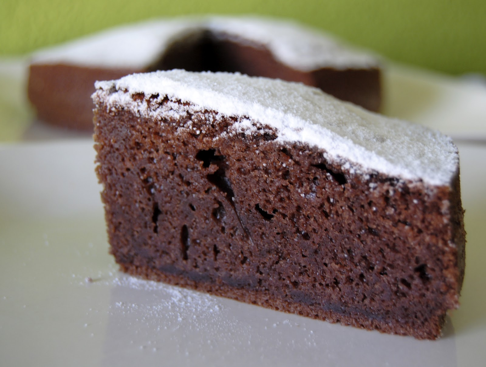

# Bizcocho de Chocolate

## Ingredientes

- 4 huevos
- 1 yogur natural (125 g)
- 1 vaso de yogur de aceite
- 2 vasos de azúcar
- 2 vasos de chocolate en polvo
- 3 vasos de harina de trigo
- 1 sobre de levadura química (tipo Royal)

## Preparación

1. Precalienta el horno a 180°C.
   
2. En un bol grande, bate los huevos junto con el yogur y el aceite hasta obtener una mezcla homogénea.
   
3. Añade el azúcar y el chocolate en polvo, y mezcla bien.
   
4. Incorpora la harina tamizada junto con el sobre de levadura y mezcla hasta obtener una masa uniforme y sin grumos.
   
5. Vierte la masa en un molde previamente engrasado y enharinado, asegurándote de distribuirla de manera uniforme.
   
6. Hornea durante aproximadamente 30 minutos, o hasta que al insertar un palillo en el centro, este salga limpio.

7. Si prefieres cocinar el bizcocho en una olla, colócala a fuego medio-bajo durante aproximadamente 1 hora o hasta que esté cocido por dentro.

8. Una vez cocido, deja enfriar el bizcocho antes de desmoldarlo.

9. Sirve el bizcocho de chocolate cortado en porciones y disfruta.

