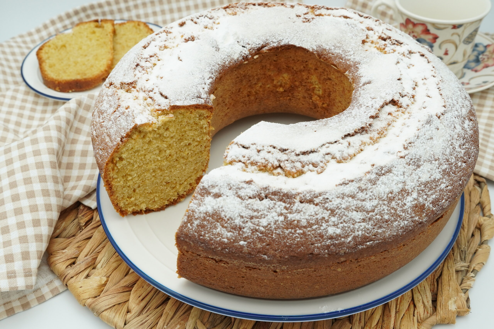

# Bizcocho

## Descripción

Un delicioso bizcocho esponjoso ideal para cualquier ocasión.

## Ingredientes

### Para el bizcocho:
- 3 huevos (separar yemas de claras)
- 300 gramos de harina
- 1 sobre de levadura tipo Royal (15 gramos)
- 1 paella de aceite (¿qué cantidad es una paella de aceite?)
- 1 pocillo de aceite (¿qué cantidad es un pocillo?)
- 1 pocillo de leche (¿qué cantidad es un pocillo?)

### Para la masa:
- 200 gramos de margarina
- 1/4 taza de azúcar
- 5 huevos
- 300 gramos de harina
- 1 sobre de levadura tipo Royal (15 gramos)
- 6 dudas de ron (¿qué cantidad es una "duda" de ron?)
- 150 gramos de frutas escarchadas
- Pasas al gusto

## Preparación

1. Precalentar el horno a 180°C (350°F). Engrasar y enharinar un molde para bizcocho.
   
2. En dos recipientes separados:
   - En el primero, batir las 3 yemas de huevo con el azúcar hasta que estén espumosas. Agregar el aceite y la leche, mezclando bien.
   
   - En el segundo recipiente, batir las claras a punto de nieve hasta que estén firmes.
   
3. Mezclar ambos preparados suavemente, añadiendo la harina y el polvo de hornear (levadura) tamizados, alternando con las frutas escarchadas y las pasas (si se usan), hasta obtener una mezcla homogénea.
   
4. Verter la mezcla en el molde preparado y alisar la superficie con una espátula.

5. Hornear durante aproximadamente 50 minutos, o hasta que al insertar un palillo en el centro del bizcocho, este salga limpio.

6. Dejar enfriar en el molde durante 10 minutos antes de desmoldar y enfriar completamente sobre una rejilla.

## Notas

- La cantidad de aceite, leche y ron no está especificada claramente. Ajusta estas cantidades según tu preferencia y experiencia en la cocina.
- Asegúrate de que los ingredientes estén a temperatura ambiente antes de comenzar.
