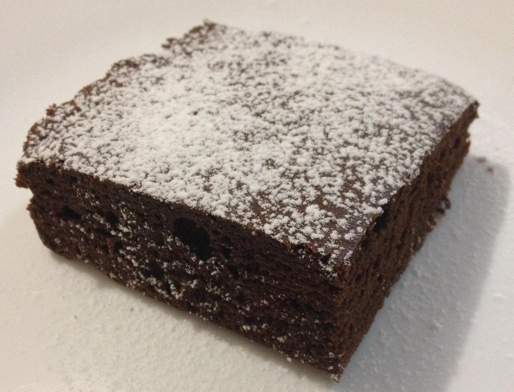

# Brownie

## Brownie Tradicional

- **Ingredientes:**
  - Mantequilla: 250 gramos
  - Azúcar: 1 vaso (aproximadamente 200 gramos)
  - Huevos: 3
  - Cacao en polvo (amargo): 1 vaso (aproximadamente 100 gramos)
  - Chocolate (amargo): 1 tableta (aproximadamente 100 gramos)
  - Harina: 1 vaso (125 ml)
  - Levadura: 1 sobre (15 gramos)

- **Instrucciones:**
  - Precalentar el horno a 180ºC.
  - En un bol grande, derretir la mantequilla y el chocolate amargo en el microondas o al baño maría.
  - Batir los huevos con el azúcar hasta que estén espumosos.
  - Agregar el cacao en polvo, la harina y la levadura tamizados a la mezcla de huevos y azúcar.
  - Incorporar la mezcla de chocolate derretido y mantequilla.
  - Verter la masa en un molde previamente engrasado y enharinado.
  - Hornear durante 30-35 minutos o hasta que al insertar un palillo en el centro, este salga limpio.
  - Dejar enfriar en el molde antes de cortar en porciones.

## Brownie al Microondas 1

- **Ingredientes:**
  - Cacao en polvo: 125 gramos
  - Mantequilla: 125 gramos
  - Azúcar: 125 gramos
  - Harina: 125 gramos
  - Huevos: 3
  - Leche: 3 cucharadas
  - Nueces: 50 gramos

- **Instrucciones:**
  - En un bol apto para microondas, derretir la mantequilla.
  - Añadir el cacao en polvo, el azúcar, la harina, los huevos y la leche.
  - Mezclar bien hasta obtener una masa homogénea.
  - Incorporar las nueces troceadas.
  - Cocinar en el microondas a máxima potencia (800W) durante 5 minutos. Luego, dejar reposar 5 minutos dentro del microondas antes de sacarlo.

## Brownie al Microondas 2

- **Ingredientes:**
  - Huevos: 3
  - Azúcar: 125 gramos
  - Leche: 3 cucharadas
  - Chocolate: 150 gramos
  - Mantequilla: 125 gramos
  - Levadura: medio sobre (aproximadamente 7 gramos)
  - Harina: 100 gramos
  - Nueces: 50 gramos

- **Instrucciones:**
  - Fundir el chocolate junto con la mantequilla en el microondas hasta que esté derretido pero no muy caliente.
  - Batir los huevos con el azúcar hasta que estén espumosos.
  - Añadir la leche y la levadura a la mezcla de huevos y azúcar.
  - Incorporar la mezcla de chocolate y mantequilla derretidos.
  - Agregar la harina y mezclar hasta que esté bien incorporada.
  - Verter la masa en un molde previamente engrasado y enharinado. Agregar las nueces troceadas.
  - Cocinar en el microondas a máxima potencia (800W) durante 5 minutos. Dejar reposar 5 minutos dentro del microondas antes de sacarlo.

Estas recetas están organizadas según el formato Markdown proporcionado, adaptando las instrucciones y ajustando algunas cantidades para mayor claridad y coherencia. Asegúrate de ajustar los tiempos y las potencias del microondas según las características de tu aparato.