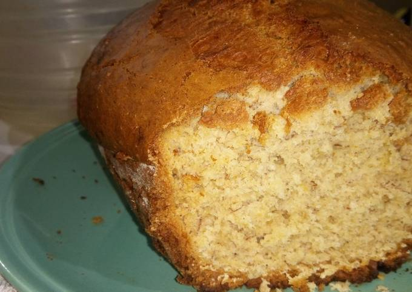

# Budín de Banana

## Ingredientes

- 1 taza y ½ de harina integral
- 1 cucharadita de bicarbonato de sodio
- 1 cucharadita de canela en polvo
- 4 cucharadas de coco rallado
- 100 gramos de nueces
- 2 huevos
- ½ taza de aceite neutro
- 1 taza de azúcar integral
- 3 bananas o plátanos maduros

## Preparación

1. Precalentar el horno a temperatura media-baja.
   
2. Pisar las bananas o plátanos con un tenedor hasta obtener un puré y reservar.

3. En un recipiente grande, mezclar la harina integral, el bicarbonato de sodio, la canela en polvo, el coco rallado y las nueces picadas.

4. En otro recipiente, batir los huevos con el azúcar hasta obtener una mezcla esponjosa. Agregar el aceite y el puré de banana, mezclando con una espátula en forma envolvente.

5. Verter la mezcla líquida sobre los ingredientes secos y mezclar hasta integrar todo. Si es necesario, añadir unas cucharadas de leche si la mezcla parece demasiado seca, aunque con las bananas maduras suele ser suficiente.

6. Verter la preparación en una budinera previamente aceitada y enharinada.

7. Hornear durante aproximadamente 45 a 60 minutos, o hasta que al insertar un palillo en el centro, este salga limpio.

8. Retirar del horno y dejar enfriar antes de desmoldar.

9. Conservar el budín envuelto en film en el refrigerador, donde puede durar varios días.

### Fuente

[Receta original en Cocina Naturista](http://cocinanaturista.blogspot.com.ar/2011/04/budin-de-banana-o-platano.html)
