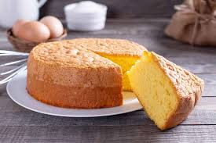

# Yogur Queque

## Ingredientes

- 2 yogures naturales
- 1 medida de aceite (utilizando el envase del yogur como medida)
- 1 medida de leche
- 2 medidas de azúcar
- 3 medidas de harina
- 1 sobre de polvos de hornear (levadura química)
- 5 huevos

## Preparación

1. Precalentar el horno a la temperatura indicada en los polvos de hornear (normalmente entre 180-200°C).

2. En un bol grande, batir los huevos con el azúcar hasta obtener una mezcla espumosa y de color claro.

3. Agregar los yogures naturales, el aceite y la leche, y mezclar bien hasta que todos los ingredientes líquidos estén incorporados.

4. Incorporar la harina previamente tamizada junto con los polvos de hornear (levadura química), mezclando suavemente hasta obtener una masa homogénea y sin grumos.

5. Verter la mezcla en un molde previamente engrasado y enharinado, asegurándose de distribuir la masa de manera uniforme.

6. Hornear durante aproximadamente 30-40 minutos, o hasta que al insertar un palillo en el centro del queque, este salga limpio.

7. Retirar del horno y dejar enfriar en el molde durante unos minutos antes de desmoldar.

8. Dejar enfriar completamente sobre una rejilla antes de cortar y servir.

## Notas

- Puedes agregar ralladura de limón o naranja a la masa si deseas darle un toque cítrico.
- Este queque es ideal para acompañar con un café o té por la tarde.
