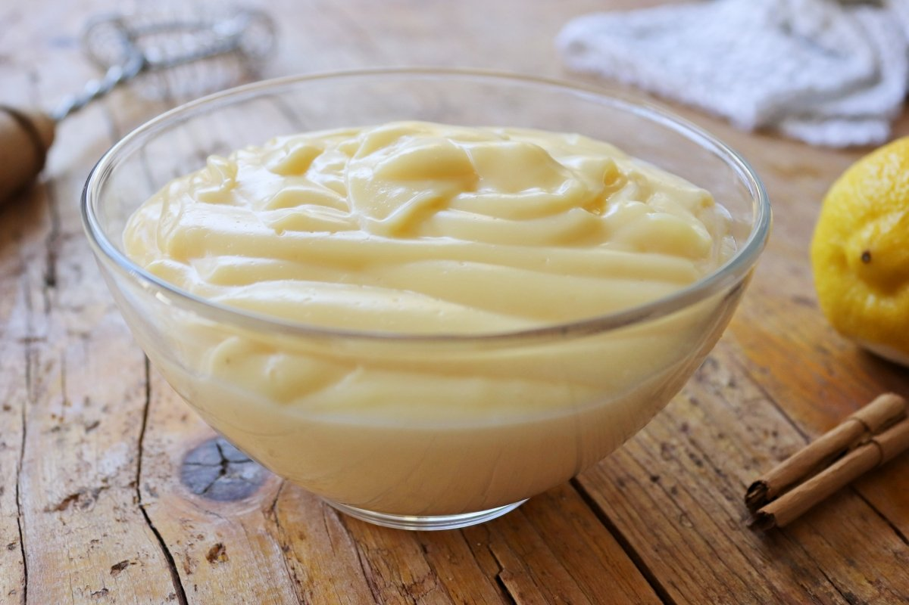

### Crema pastelera

#### Ingredientes

- 2 huevos
- 1/2 litro de leche
- 4 cucharadas de azúcar
- 2 cucharadas de Maicena

#### Preparación

1. Separar las yemas de los huevos.
2. Batir las yemas junto con el azúcar y la Maicena hasta obtener una mezcla homogénea.
3. Calentar la leche a fuego medio sin que hierva.
4. Poco a poco, incorporar la mezcla de yemas, azúcar y Maicena a la leche caliente, removiendo constantemente para evitar grumos.
5. Cocinar a fuego medio-bajo, sin dejar de remover, hasta que la crema espese lo suficiente para cubrir una cuchara.
6. Retirar del fuego y dejar enfriar antes de utilizarla como relleno o decoración en tus postres.

### Crema pastelera 2

#### Ingredientes

- 250 gramos de azúcar
- 100 gramos de harina
- 50 gramos de mantequilla
- 6 yemas de huevo
- 1 litro de leche
- 1 corteza de limón
- 1/2 ramita de canela

#### Preparación

1. Derretir la mantequilla en una cacerola a fuego bajo.
2. Agregar la leche, la corteza de limón y la ramita de canela a la cacerola con la mantequilla derretida. Calentar hasta que esté casi hirviendo, luego retirar del fuego y dejar infusionar.
3. En un bol aparte, batir las yemas de huevo con el azúcar y la harina hasta obtener una mezcla homogénea.
4. Retirar la corteza de limón y la canela de la leche infusionada.
5. Poco a poco, añadir la mezcla de yemas, azúcar y harina a la leche caliente, removiendo constantemente para evitar la formación de grumos.
6. Volver a poner la cacerola en el fuego y cocinar a fuego medio-bajo, sin dejar de remover, hasta que la crema espese y llegue a hervir.
7. Retirar del fuego y seguir removiendo unos minutos más.
8. Verter la crema pastelera en un recipiente de cristal y dejar enfriar completamente antes de usarla.

