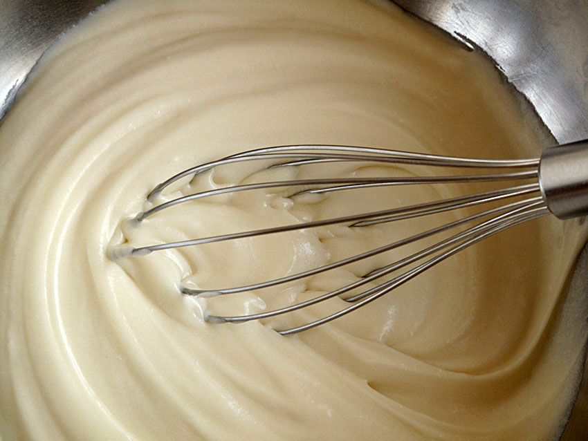

# Crema de relleno de tarta

## Ingredientes

- 4 huevos
- 4 cucharadas de harina
- 4 cucharadas de azúcar
- 1 litro de leche
- Cáscara de limón
- 1 palito de canela

## Preparación

1. En una cacerola grande, poner a hervir 1 litro de leche con la cáscara de limón y el palito de canela. Dejar hervir a fuego medio durante aproximadamente media hora para infusionar los sabores.
   
2. En un bol aparte, mezclar las 4 cucharadas de azúcar y las 4 cucharadas de harina.

3. En otro recipiente, batir los huevos hasta que estén bien mezclados.

4. Incorporar la mezcla de azúcar y harina a los huevos batidos, mezclando bien para evitar grumos.

5. Retirar la cáscara de limón y el palito de canela de la leche infusionada y verter lentamente la mezcla de huevos, azúcar y harina en la leche caliente, removiendo constantemente con una cuchara de madera.

6. Cocinar a fuego medio, sin dejar de remover, hasta que la crema espese y alcance la consistencia deseada.

7. Una vez que la crema haya hervido unos minutos y esté bien espesa, retirar del fuego y dejar enfriar antes de utilizarla como relleno para tartas u otros postres.
