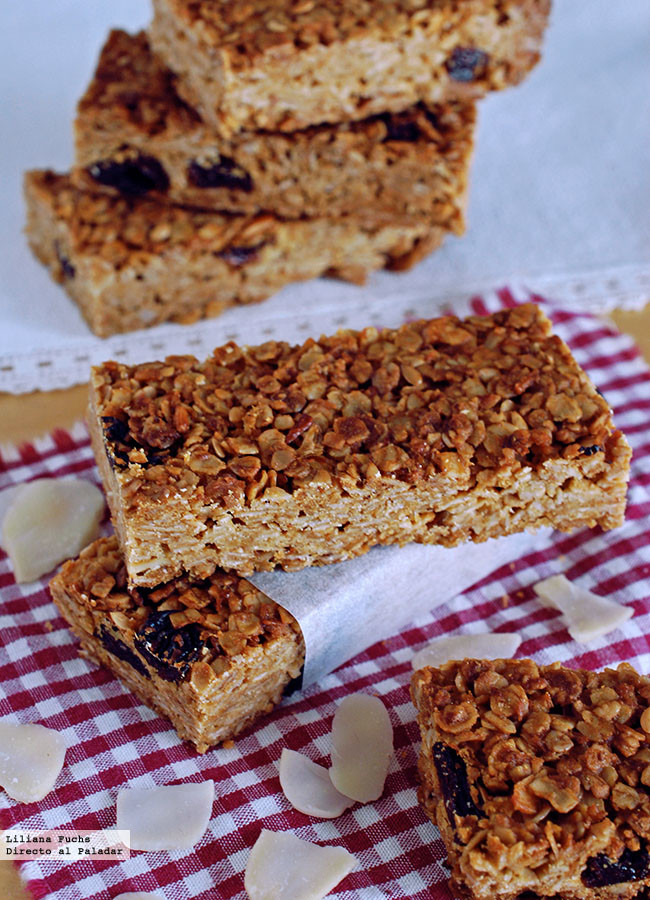

# Barritas de Cereales 🍪

## Ingredientes
(para una bandeja de 24cm x 36cm)

- 390 gr de copos de avena
- 65 gr de coco rallado
- 65 gr de harina de arroz
- 65 gr de almendras laminadas o en cubitos pequeños
- [opcional] 30 gr de semillas de sésamo
- 1 pizca de sal
- [opcional] 1 cucharada sopera de dextrosa
- 200 ml de leche de arroz
- 80 ml de aceite de girasol
- 80 ml de jarabe de arroz

## Preparación

1. Precalienta el horno a 160°C (en nuestro horno a 180°C) encendido por arriba y por abajo.
2. Mezcla los ingredientes secos en un bol grande.
3. Añade la leche de arroz y mezcla bien.
4. Incorpora el aceite de girasol y el jarabe de arroz, y mezcla hasta obtener una masa homogénea.
5. Coloca la mezcla en un molde forrado con papel de hornear, compactándola con una espátula para que quede bien distribuida y alisada.
6. Marca con un cuchillo las divisiones para las barritas antes de hornear.
7. Hornea durante 50 minutos o hasta que estén doradas.
8. Deja enfriar las barritas en el molde durante 5-10 minutos antes de cortarlas completamente y luego déjalas enfriar completamente sobre una rejilla.

### Variaciones

- Puedes sustituir la leche de arroz por cualquier otra leche vegetal, como la leche de coco.
  
#### Fuentes

- [Barritas de cereales con avena, almendra y coco: receta para llevar energía en la mochila](https://www.directoalpaladar.com/postres/barritas-de-cereales-con-avena-almendra-y-coco-receta)

##### Notas

- <a name="footnote1">1</a>: En nuestro horno a 180°C.
- <a name="footnote2">2</a>: Puedes sustituir el jarabe de arroz por 60 ml de jarabe de arce.
