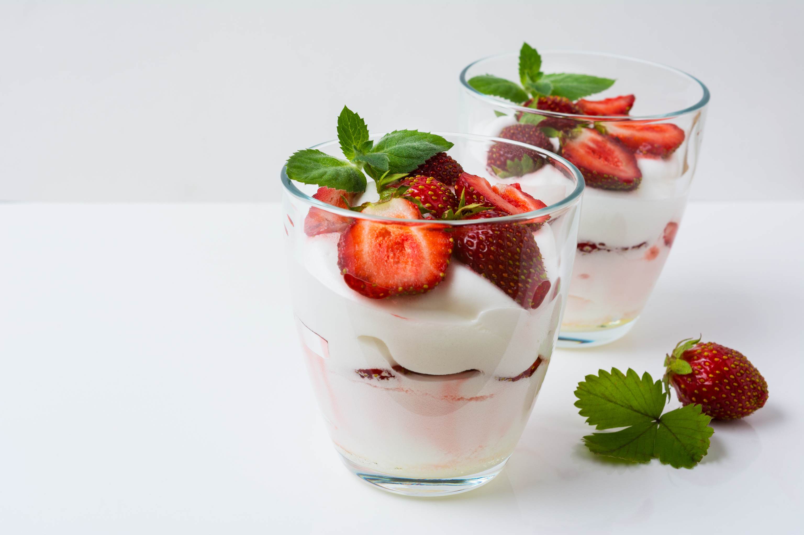

# Fresones a la Crema

## Ingredientes

- 1 bote de nata (crema de leche)
- 1/2 kg de fresones (fresas)
- 4 cucharadas de azúcar
- 1/2 bote de mermelada de fresa
- Vinagre (unas gotas)

## Preparación

1. Limpia los fresones y espolvorea con azúcar. Rocíalos con unas gotas de vinagre y déjalos en el refrigerador durante unas horas.
   
2. Calienta la mermelada de fresa en un cazo a fuego suave hasta que esté fundida.
   
3. Pasa la mermelada por un colador fino para eliminar posibles grumos. Añade la nata (crema de leche) y mezcla bien hasta que esté integrada.
   
4. Coloca los fresones en platos individuales o en un plato grande y cubre con la crema preparada anteriormente.

5. Sirve los fresones a la crema como postre.

