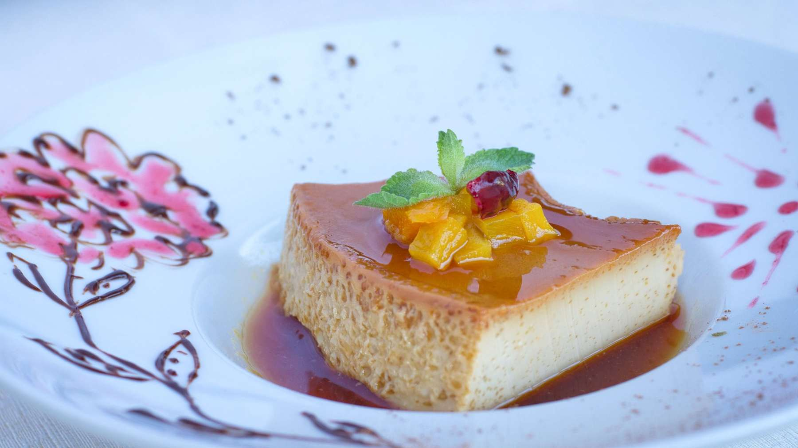

# Leche Asada Canaria

## Ingredientes

- 4 huevos
- 4 cucharadas de azúcar
- 1 cucharada de canela en polvo
- Ralladura de 1 limón
- 1/2 litro de leche

## Preparación

1. Precalentar el horno a 170°C (340°F). Engrasar un molde apto para horno con mantequilla.

2. En un bol grande, batir los huevos junto con el azúcar, la canela en polvo y la ralladura de limón, hasta obtener una mezcla homogénea.

3. Calentar la leche hasta que esté tibia y luego incorporarla a la mezcla de huevo batido. Mezclar bien.

4. Verter la mezcla en el molde previamente engrasado.

5. Hornear a 170°C durante aproximadamente 30 minutos, o hasta que al insertar un palillo en el centro, este salga limpio.

6. Retirar del horno y dejar enfriar completamente a temperatura ambiente.

7. Una vez frío, verter miel alrededor del borde de la leche asada como se indica.

## Notas

- La leche asada canaria se sirve tradicionalmente fría, por lo que es importante dejarla enfriar completamente antes de servir.
- Puedes espolvorear un poco de canela en polvo sobre la superficie antes de servir, si lo deseas.
