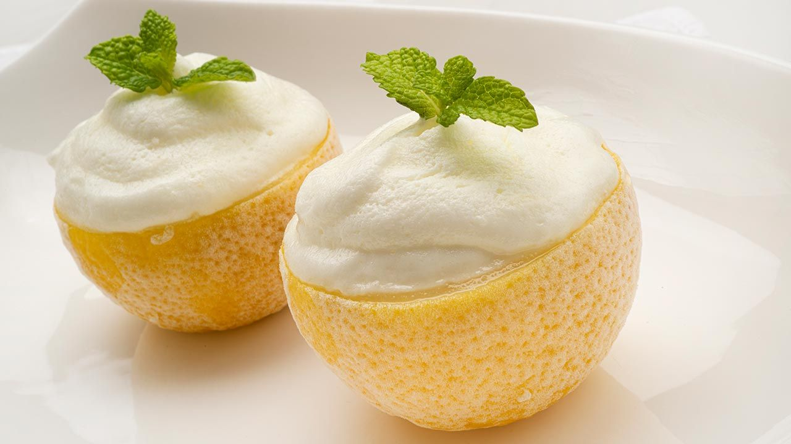

# Limones rellenos

## Descripción

Los limones rellenos son un postre refrescante y delicioso, ideal para servir después de una comida. Puedes experimentar con diferentes frutas cítricas como naranjas o limones para variar el sabor.

## Ingredientes

* 6 cucharadas de leche condensada
* 4 limones
* 1 chorrito de anís
* 4 yemas de huevo
* Claras a punto de nieve

## Preparación

1. Vaciar los 4 limones cuidadosamente para usar su cáscara como recipiente.
2. Preparar la masa mezclando las yemas de huevo con la leche condensada y el chorrito de anís.
3. Incorporar las claras a punto de nieve a la mezcla anterior, de manera suave y envolvente.
4. Rellenar los limones vacíos con la masa preparada.
5. Refrigerar los limones rellenos durante al menos 1 hora antes de servir.

## Notas

> Se puede experimentar con otras frutas cítricas como naranjas para variar el sabor del relleno. Asegúrate de vaciar los limones con cuidado para no romper la cáscara.