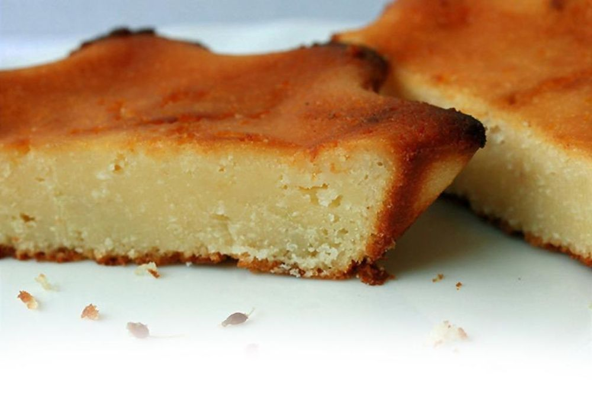

# Quesadilla

## Ingredientes

- 1 bote mediano de leche condensada (aproximadamente 400 gramos)
- 4 huevos
- 1 vaso de leche (250 ml)

## Preparación

1. Precalentar el horno a 180°C (350°F).

2. En un bol grande, batir la leche condensada, los huevos y la leche hasta obtener una mezcla homogénea.

3. Caramelizar un molde con caramelo líquido y verter la mezcla preparada en él.

4. Colocar el molde dentro de otro recipiente más grande con agua caliente, creando un baño María.

5. Hornear la quesadilla al baño María durante aproximadamente 30 minutos, o hasta que esté cuajada y dorada en la superficie.

6. Retirar del horno y dejar enfriar completamente a temperatura ambiente.

7. Refrigerar durante al menos 2 horas antes de servir, para que adquiera mejor consistencia y se sirve frío.

## Notas

- Puedes decorar la quesadilla con frutas frescas, como fresas o kiwi, antes de servir para darle un toque fresco y colorido.
- El baño María ayuda a que la quesadilla se cocine suavemente y adquiera una textura firme y uniforme.
