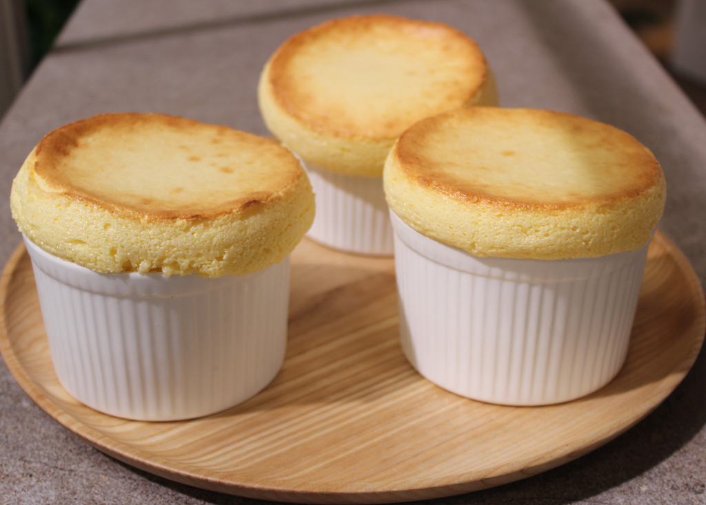

# Suflé de Naranja

## Ingredientes

### Para la crema pastelera:
- 500 ml de leche
- 5 yemas de huevo
- 50 gramos de fécula de maíz
- 150 gramos de azúcar
- Ralladura de 2 naranjas
- 150 ml de zumo de naranja

### Para el merengue:
- 6 claras de huevo
- 70 gramos de azúcar

## Preparación

1. Calentamos la leche e infusionamos con la ralladura de naranja.
2. Blanqueamos las yemas con el azúcar, añadimos la fécula y seguimos trabajando.
3. Añadimos la leche caliente, movemos bien y volvemos al fuego hasta espesar. Cocemos durante unos 5 minutos hasta obtener una crema pastelera lisa y brillante.
4. Ponemos a reducir el zumo de naranja a fuego bajo para concentrar los sabores.
5. Integramos el zumo reducido a temperatura ambiente a la crema pastelera. Enfriamos en la nevera.
6. Montamos las claras a punto de nieve junto con el azúcar hasta que quede muy brillante.
7. Mezclamos el merengue con la crema pastelera: primero una tercera parte del merengue y batimos, luego añadimos el resto del merengue y mezclamos con movimientos envolventes.
8. Pintamos los ramequines con mantequilla derretida, moviendo de abajo hacia arriba para ayudar al suflé a crecer. Espolvoreamos con azúcar, eliminando el exceso.
9. Rellenamos los ramequines con la crema pastelera. Alisamos y limpiamos bien los bordes.
10. Horneamos a 180ºC durante unos 12-14 minutos, hasta que estén dorados y esponjosos.
11. Sacamos del horno y consumimos inmediatamente.

