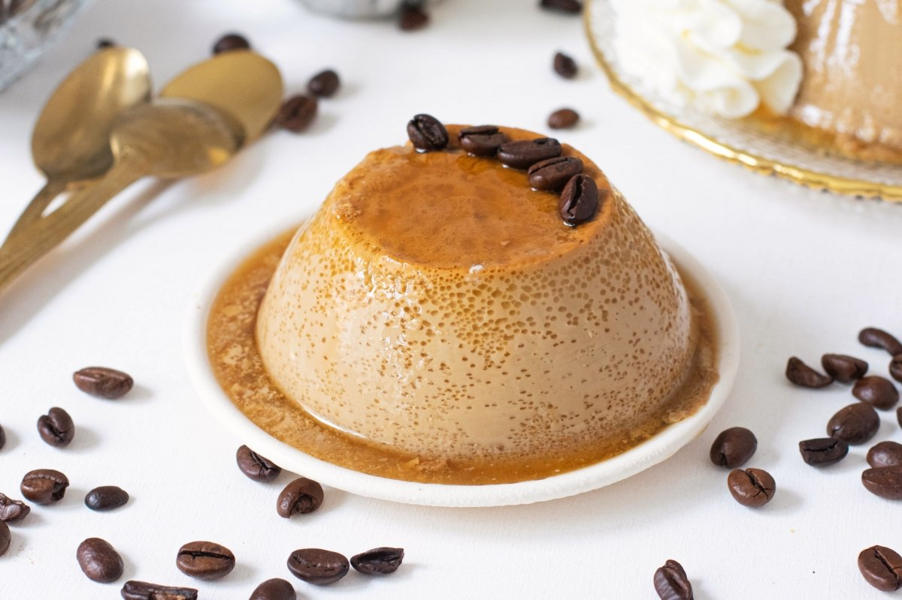

# Flan de café

## Descripción

El flan de café es un postre suave y cremoso con un delicioso sabor a café, ideal para disfrutar después de una comida.

## Ingredientes

* 1 litro de nata (crema de leche)
* 1 sobre de preparado para flan (por ejemplo, Flan Royal)
* 1 vaso de café (preparado y frío)
* 2 cucharadas de azúcar

## Preparación

1. En una olla, mezclar la nata con el sobre de preparado para flan y las 2 cucharadas de azúcar.
2. Agregar el vaso de café frío a la mezcla.
3. Llevar la mezcla a fuego medio y remover constantemente hasta que comience a hervir.
4. Una vez que hierva, retirar del fuego y pasar por un colador fino para asegurarse de que no queden grumos.
5. Verter la mezcla caliente en un molde previamente caramelizado. Para caramelizar el molde, calentar azúcar en una sartén hasta que se derrita y adquiera color dorado, luego verterlo rápidamente en el molde y distribuirlo uniformemente por las paredes.
6. Dejar enfriar a temperatura ambiente y luego refrigerar durante al menos 4 horas, o hasta que esté completamente cuajado.
7. Desmoldar con cuidado antes de servir.

## Notas

> El café debe estar completamente frío para agregarlo a la mezcla caliente de nata y flan. Asegúrate de pasar la mezcla por un colador fino para obtener un flan suave y sin grumos. El tiempo de refrigeración es crucial para que el flan adquiera la consistencia adecuada. Puedes decorar el flan de café con un poco de nata montada o simplemente servirlo solo para disfrutar de su sabor intenso a café.