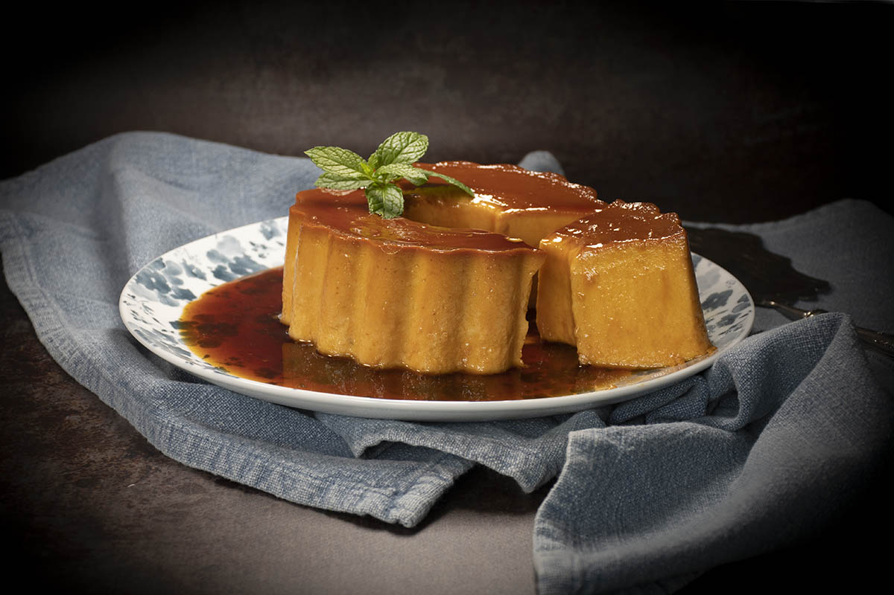

# Flan de calabaza

## Descripción

El flan de calabaza es un postre cremoso y con un sutil sabor a calabaza asada, perfecto para disfrutar en épocas frescas.

## Ingredientes

* 350 gramos de calabaza asada en el horno
* 4 huevos
* 400 ml de leche evaporada
* 150-200 gramos de azúcar (ajustar al gusto)

## Preparación

1. Precalentar el horno a 180°C.
2. En un procesador de alimentos o licuadora, mezclar la calabaza asada hasta obtener un puré suave.
3. En un bol grande, batir los huevos junto con la leche evaporada.
4. Incorporar el puré de calabaza y el azúcar a la mezcla de huevos y leche, y seguir batiendo hasta que esté bien integrado.
5. Verter la mezcla en un molde previamente caramelizado. Para caramelizar el molde, calentar azúcar en una sartén hasta que se derrita y adquiera color dorado, luego verterlo rápidamente en el molde y distribuirlo uniformemente por las paredes.
6. Colocar el molde en una bandeja para hornear con agua caliente (baño María) y hornear a 180°C durante aproximadamente 60 minutos, o hasta que el flan esté firme y dorado en la superficie.
7. Retirar del horno y dejar enfriar a temperatura ambiente.
8. Refrigerar durante al menos 30 minutos antes de desmoldar y servir.

## Notas

> La calabaza asada aporta un sabor dulce y una textura suave al flan. Puedes ajustar la cantidad de azúcar según tu preferencia por lo dulce. Asegúrate de utilizar un molde apto para horno y de caramelizarlo adecuadamente para facilitar el desmoldado del flan. Este flan de calabaza es ideal para servir como postre después de una comida o para disfrutar en cualquier ocasión especial.