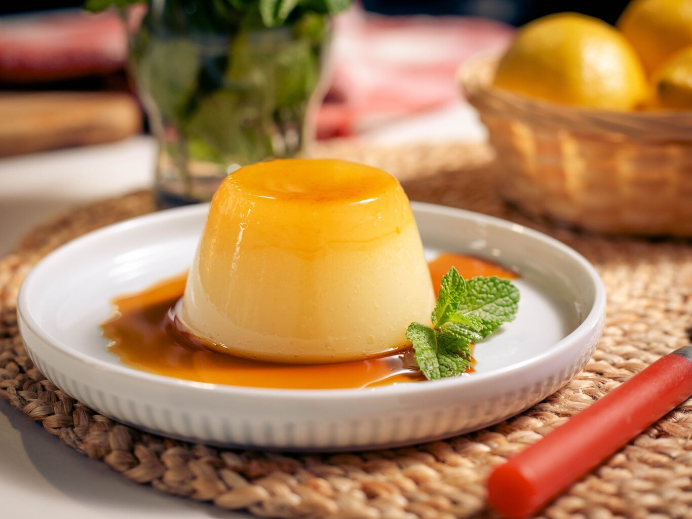

# Flan de limón

## Descripción

El flan de limón es un postre refrescante y aromático con un toque cítrico, ideal para disfrutar en cualquier ocasión.

## Ingredientes

* 2 galletas tostadas
* 100 gramos de azúcar (5 cucharadas)
* 1 limón (zumo y ralladura)
* 1 caja de gelatina de limón (por ejemplo, Royal)
* 1 bote de leche evaporada

## Preparación

1. Triturar las galletas tostadas hasta obtener migas finas.
2. En un bol, mezclar las migas de galleta con el azúcar.
3. En una olla, poner a hervir 3/4 de agua. Cuando hierva, retirar del fuego y agregar 1/2 vaso más de agua fría.
4. Añadir el zumo y la ralladura de limón, la gelatina de limón y el azúcar al agua caliente. Mezclar bien hasta que la gelatina y el azúcar se disuelvan por completo.
5. Incorporar la leche evaporada al bol y mezclar hasta que todos los ingredientes estén bien combinados.
6. Verter la mezcla en moldes individuales o en un molde grande previamente engrasado.
7. Refrigerar durante al menos 3 horas, o hasta que el flan esté firme y completamente cuajado.
8. Desmoldar con cuidado antes de servir.

## Notas

> El flan de limón es un postre que se sirve frío, ideal para los días calurosos. Puedes decorarlo con rodajas de limón o ralladura adicional para darle un toque extra de sabor y presentación. Asegúrate de dejar suficiente tiempo de refrigeración para que la gelatina y la leche evaporada se asienten adecuadamente y el flan adquiera la consistencia deseada.