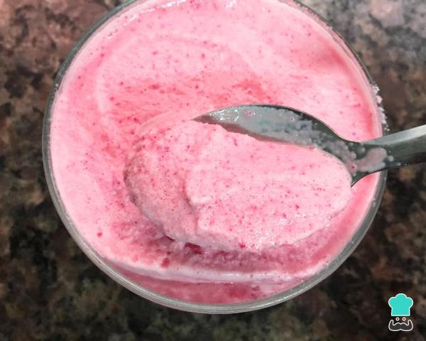

# Helado - Gelatina de fresa

## Descripción

Este postre combina la frescura de la gelatina de fresa con la cremosidad del helado, ideal para disfrutar en los días calurosos.

## Ingredientes

* 8 sobaos
* 1 sobre de gelatina de fresa (o del sabor de tu elección)
* 2 botes de nata (crema de leche)
* 1 tarrina de queso Philadelphia
* Mermelada (para adornar)

## Preparación

1. Preparar la gelatina siguiendo las instrucciones del paquete. Dejar enfriar a temperatura ambiente hasta que esté a punto de cuajar, pero aún líquida.
2. En un bol grande, mezclar el queso Philadelphia con la nata (crema de leche) utilizando una batidora eléctrica hasta obtener una mezcla suave y cremosa.
3. Agregar la gelatina preparada a la mezcla de queso y nata. Batir nuevamente hasta que esté bien incorporada.
4. Cortar los sobaos por la mitad longitudinalmente y colocarlos en una fuente o recipiente apto para congelador.
5. Verter la mezcla de queso, nata y gelatina sobre los sobaos, asegurándote de cubrirlos por completo.
6. Colocar en el congelador y dejar enfriar durante al menos 4 horas, o hasta que esté completamente congelado.
7. Antes de servir, sacar del congelador y adornar con mermelada de fresa por encima.

## Notas

> El uso de sobaos proporciona una textura suave y esponjosa al helado. Asegúrate de dejar suficiente tiempo de congelación para que el postre adquiera la consistencia adecuada. Puedes utilizar gelatina de otros sabores como limón para variar el sabor del helado. Este helado - gelatina de fresa es perfecto para refrescarse en verano y deleitar a los amantes de los postres cremosos y frutales.