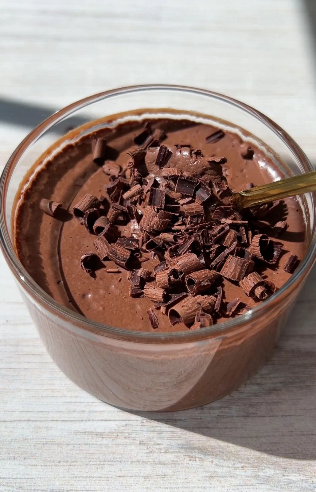

# Mousse de Chocolate

## Ingredientes

- 1 tableta de chocolate sin leche (200 gramos)
- 100 gramos de mantequilla
- 3 huevos
- 2 vasos de agua
- Nata para montar (cantidad al gusto)
- Barquillos (para decorar)

## Preparación

1. En un cazo a fuego lento, derretir el chocolate junto con los 2 vasos de agua, removiendo constantemente hasta obtener una mezcla suave y homogénea.

2. Retirar el cazo del fuego y añadir la mantequilla, mezclando bien hasta que se incorpore completamente. Dejar enfriar la mezcla a temperatura ambiente.

3. Mientras tanto, batir las claras de huevo a punto de nieve en un bol grande hasta que formen picos firmes.

4. Una vez que la mezcla de chocolate esté fría (pero aún líquida), incorporar las yemas de huevo una a una, mezclando bien después de cada adición.

5. Con cuidado, incorporar las claras batidas a punto de nieve a la mezcla de chocolate, utilizando movimientos suaves y envolventes para mantener la textura aireada de la mousse.

6. Verter la mezcla en un recipiente adecuado para congelador y dejar reposar en el congelador durante aproximadamente 2 horas para que adquiera consistencia.

7. Pasado el tiempo de congelación, trasladar la mousse al refrigerador y dejar enfriar durante al menos 1 hora más.

8. Antes de servir, montar la nata y decorar la mousse con nata montada, rutas y barquillos.

## Notas

- Asegúrate de que el chocolate esté completamente derretido y la mezcla esté fría antes de incorporar las claras de huevo.
- Los barquillos y la nata montada son perfectos para decorar esta deliciosa mousse de chocolate.
