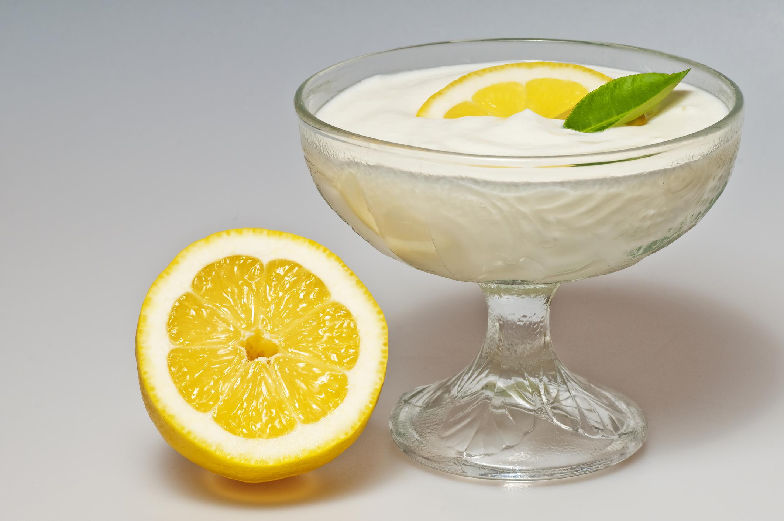

# Mousse de Limón

## Ingredientes

- 1 bote de leche condensada (aproximadamente 400 gramos)
- 1/2 kg de nata para montar (500 ml)
- 3 limones
- Ralladura de 1 limón (opcional, para decorar)

## Preparación

1. En un bol grande, mezclar la leche condensada con el zumo de los 3 limones hasta que estén bien incorporados.

2. Incorporar la ralladura de 1 limón (opcional) para intensificar el sabor.

3. En otro recipiente, montar la nata hasta obtener picos suaves.

4. Incorporar la nata montada a la mezcla de leche condensada y limón, utilizando movimientos suaves y envolventes para mantener la textura ligera de la mousse.

5. Verter la mezcla en copas individuales o en un recipiente grande.

6. Refrigerar durante al menos 2 horas, o hasta que la mousse esté firme.

7. Antes de servir, adornar cada porción con tiras finas de piel de limón para decorar.

## Notas

- Asegúrate de que la leche condensada esté bien mezclada con el zumo de limón para lograr un sabor equilibrado.
- La ralladura de limón añade un toque de frescura y aroma a la mousse.
