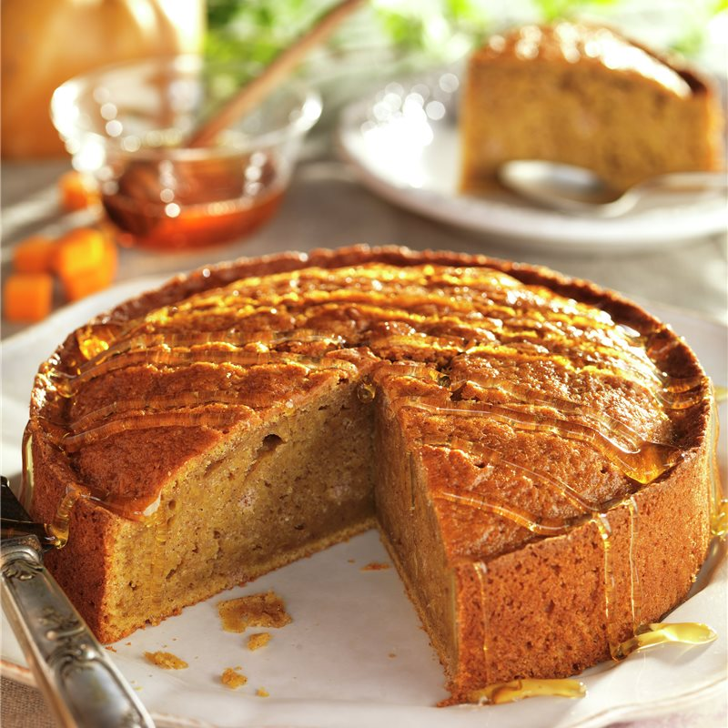

# Tarta de calabaza

## Ingredientes

- Una calabaza de tamaño mediano
- Una cebolla mediana a grande
- Dos huevos
- Queso fresco (mantecoso o mozzarella)
- Queso rallado
- 250 ml de crema de leche
- Dos tapas de masa para tarta (o masa casera)

## Preparación

1. Pelar la calabaza, cortarla por la mitad para quitar las semillas y luego cortarla en dados.
2. Cocinar la calabaza en una olla con sal al gusto hasta que esté tierna. Escurrir bien y hacer un puré con un tenedor o procesador de alimentos.
3. Picar la cebolla en trozos medianos y rehogarla en una sartén con un poco de aceite hasta que esté transparente y tierna.
4. Agregar la crema de leche a la cebolla rehogada y cocinar a fuego lento durante unos minutos.
5. Mezclar el puré de calabaza con la mezcla de cebolla y crema de leche.
6. Agregar los huevos batidos y trozos de queso fresco al puré de calabaza. Mezclar bien.
7. Precalentar el horno a una temperatura media.
8. Colocar una de las tapas de masa para tarta en una tartera. Distribuir tiras o trozos de queso fresco sobre la base.
9. Verter el relleno de calabaza sobre la base de masa, esparciéndolo de manera uniforme.
10. Espolvorear queso rallado sobre el relleno de calabaza.
11. Colocar la segunda tapa de masa para tarta sobre el relleno y cerrar la preparación.
12. Hornear la tarta en el horno precalentado durante 25-30 minutos, o hasta que la masa esté dorada y el relleno esté completamente cocido.
13. Retirar del horno y dejar enfriar antes de servir.

## Notas

> Esta tarta de calabaza es una deliciosa opción vegetariana para disfrutar como plato principal. Puedes preparar la masa para tarta casera o utilizar tapas comerciales según tu preferencia y tiempo disponible. Asegúrate de dejar enfriar un poco el relleno antes de verterlo sobre la masa para evitar que desarme las tapas de tarta. ¡Disfruta esta tarta de calabaza con su suave textura y sabor reconfortante!